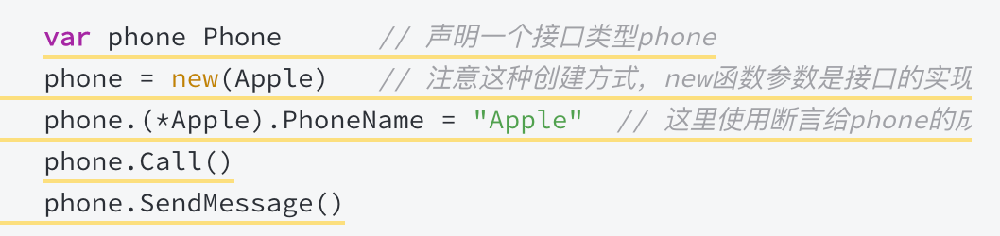
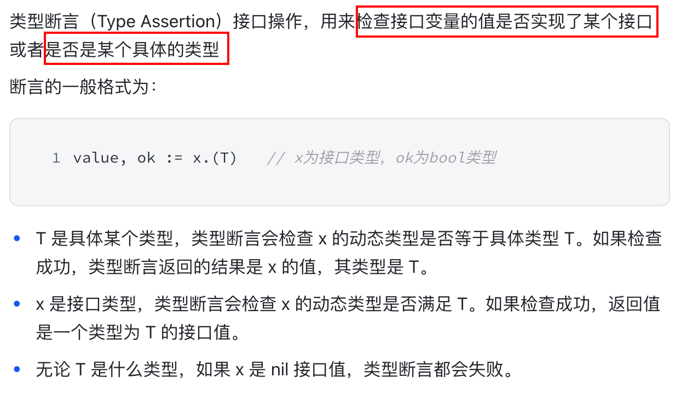
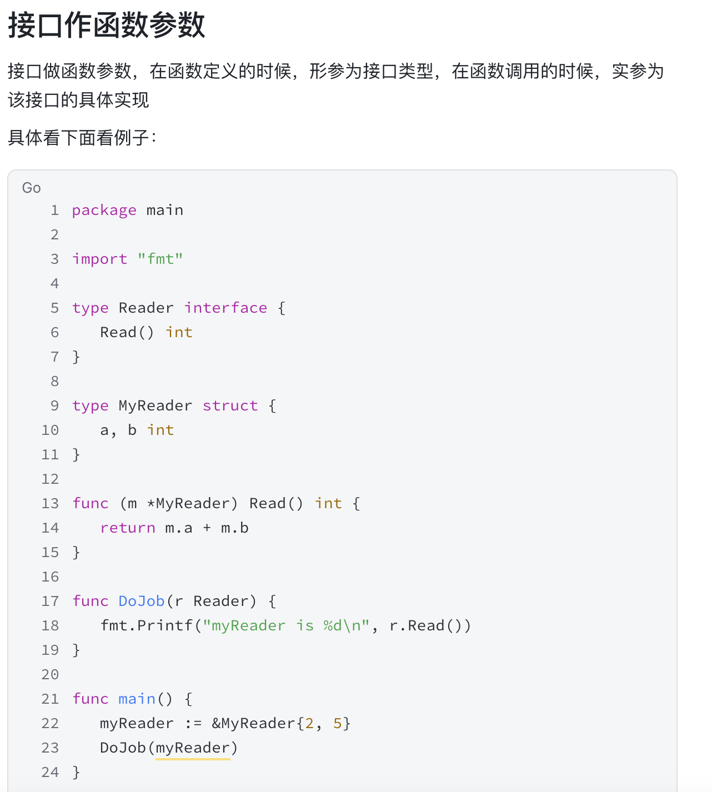

+++
title = "Go 基础"
weight = 10
type = "docs"
layout = "page"
+++

1. Iota 理解使用
2. for range 循环过程中，每个遍历的值为值拷贝，且用一个固定的内存空间存储该值，因此遍历过程中，该值的内存地址不变，这也是 Go 遍历时的内存优化体现

```go
arr := []int{1, 2, 3, 4}
for i, v := range arr {
    fmt.Println("i=", i)
    fmt.Println("v=", arr[i])
    fmt.Println(&v)
}
```

1. 循环遍历切片的同时向切片中添加值，循环会停止

```go
arr := []int{1, 2, 3, 4}
for i := range arr {
    arr = append(arr, arr[i])
}
fmt.Println(arr)
```

1. 当某种类型 T 实现了某接口 i，则可以给初始化该类型并赋给该接口



```go
type i interface {
    Say(s string) string
}
type People struct {
    Name string
}

func (p *People) Say(s string) string {
    fmt.Println(p.Name)
    return s
}

var ss i
ss = new(People) // People 实现了 i 接口，因此 ss 可以被 new(People) 赋值
ss.(*People).Name = "huang"
ss.Say("hello")

// note: 同理，任何类型实现了空接口，因此空接口可以接收任意类型的值
```

1. 空接口


1. 类型断言



1. 接口作为函数参数



1. Error

```go
// error 就是一个普通的接口
type error interface {
    Error() string
}


// errors.go.   errors.New() 源码
func New(text string) error {
    return &errorString{text}
}
// errorString is a trivial implementation of error.
type errorString struct {
    s string
}
func (e *errorString) Error() string {
    return e.s
}

//
```

1. [TODO] defer
2. [TODO] 异常捕获
3. [TODO] 依赖管理
4.
