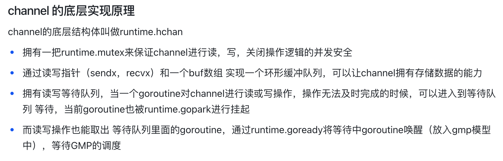
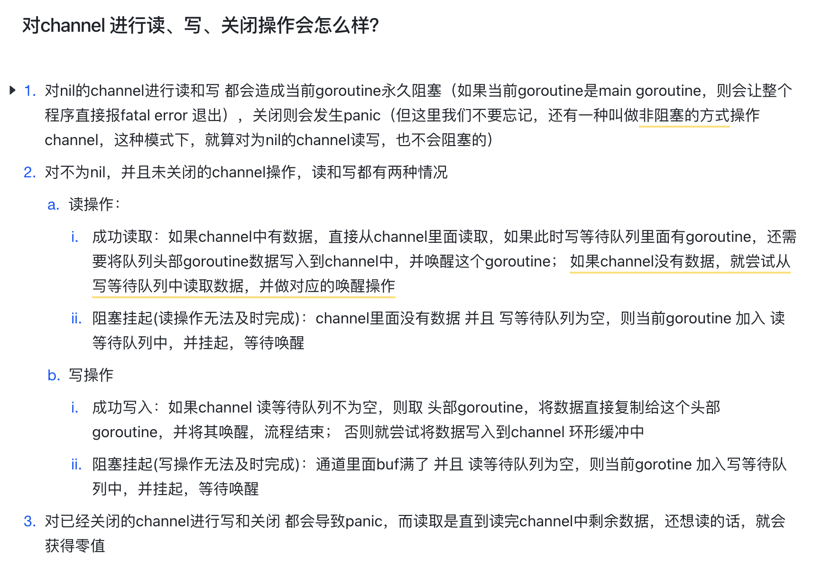

+++
title = "数据结构"
weight = 40
type = "docs"
layout = "page"
+++

## 字符串 String

String 底层是 stringStruct

```sql
type stringStruct {
    str unsafe.point
    len int
}
```

String 与 []byte 的转换，会发生一次值拷贝

## 数组 Array

数组是值类型，传递时是值拷贝，传递的是值的副本

数组**长度是固定**的，声明时长度已经固定，若需要更长的数组，需要重新声明定义，抛弃旧数组

对**动态数据集合的问题处理不友好**

基于这两个问题，产生了 slice

## 切片 Slice

## 映射 Map

1. 通过 read 和 dirty 两个字段实现数据的读写分离，读的数据存在只读字段 read 上，将最新写入的数据则存在 dirty 字段上
2. 读取时会先查询 read，不存在再查询 dirty，写入时则只写入 dirty
3. 读取 read 并不需要加锁，而_读或写 dirty 则需要加锁_
4. 另外有 _misses_ 字段来统计 read 被穿透的次数（被穿透指需要读 dirty 的情况），超过一定次数则将 dirty 数据更新到 read 中（触发条件：misses=len(dirty)）

## 通道 channel





