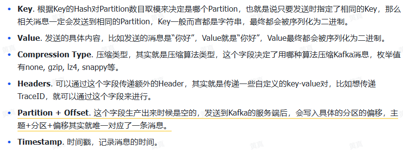
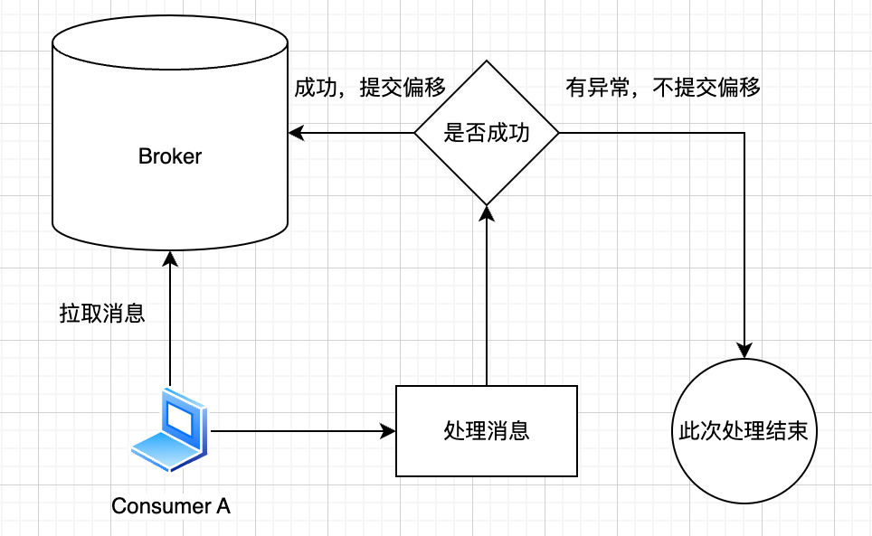

+++
title = "Kafka"
weight = 10
type = "docs"
layout = "page"
+++

## 架构

### Topic

消息的逻辑划分

一个 topic 包含多个 partition

### Partition

消息的物理存储单元

### Broker

服务实例，消息的存储载体

### Producer

消息生产者

#### 消息数据结构

### Consumer

消息消费者：使用拉模式（消费者主动请求 kafka 获取信息，而不是 kafka 主动推送），目的是让消费者自控消费速度，消费者可设置拉取频率

#### 消费组

消费组消费某个 topic，组内每个消费组承担一部分 partition，这样就水平扩展了消费能力

## 消息实践

### 如何保证消息不丢

什么情况会丢？

1. 生产环节
2. 存储环节
3. 消费环节

要保证消息不丢，无非就是这三个阶段，

#### 生产环节

Kafka 无法保证，客户端/生产端自行保证，如发送记录、重试、确认机制

#### 存储环节

持久化机制保证可靠存储，副本机制（每个分区创建副本）保证更可靠

基于生产端提供的 ACK 策略，进行副本写入

#### 消费环节

偏移量机制，只有消费端成功处理才提交偏移到 broker，否则不提交偏移，这样下次还是会拉取到这条消息重新消费

通常情况下，大多业务没必要绝对不丢失：

- 生产时一般多重试几次即可
- 写入策略通常主节点确认即可，无需同步到其他副本节点再确认
- 消费阶段成功后再提交

### 如何让消息不重复

### 如何让消息有序

### 消息挤压怎么处理
