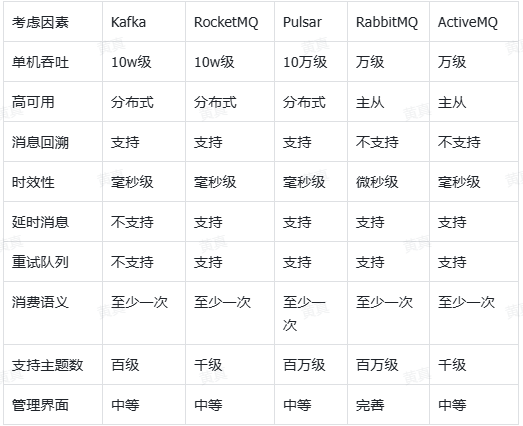

+++
title = "MQ"
weight = 50
type = "docs"
layout = "section"
+++

## 应用场景

1. 业务解耦：业务上不需要依赖
2. 异步调用：可能会关注结果（采用回调或者反馈队列等方式）
3. 流量削峰：用于突发流量，而不是持续流量（系统性能优化）
4. 消息分发：用于多个消费者关注同一消息（多人订阅）

## 消息队列对比

## 消费语义

1. 至少一次：消息不会丢失，但有可能被重复发送处理，其适用于对消息传递可靠性有要求，但可以容忍消息重复的场景，如事件通知
2. 至多一次：消息可能会丢失，但绝不会重复入队，其适用于对消息传递可靠性要求不高的场景，如日志记录。
3. 精准一次：消息不会丢失，也不会被重复发送，其适用于关键业务场景，需要严格保证消息处理一次且仅一次，如金融交易处理

rabbitMQ / kafka 如何保证消费精准一次（exactly-once）：

[https://blog.csdn.net/qq_30009397/article/details/126766269](https://blog.csdn.net/qq_30009397/article/details/126766269)

## 参考：

消息队列十连问：[https://mp.weixin.qq.com/s/x5ugQ-GPbslOH12nYewnFg](https://mp.weixin.qq.com/s/x5ugQ-GPbslOH12nYewnFg)

消息队列对比、选型、剖析：[https://cloud.tencent.com/developer/article/2449704](https://cloud.tencent.com/developer/article/2449704)

[rabbitMQ](https://iqop6is7zk9.feishu.cn/wiki/UaTewCebJincHDk0lWYcDAufnOd)

[kafka](https://iqop6is7zk9.feishu.cn/wiki/HK6Fwpf9ti6KEykKUg5cOnLLn9b)
