+++
title = "事务"
weight = 20
type = "docs"
layout = "page"
+++

## 概念

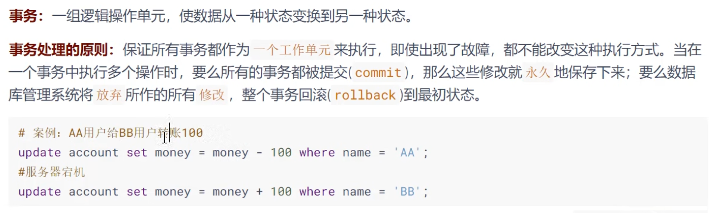

## ACID 特性

原子性 **Atomicity **：要么全部执行，要么全部不执行

一致性 **Consistency **：达到一致的状态。满足现实约束下的一致性状态

隔离性 **Isolation **：并发执行的各个事务之间相互隔离，互不影响

持久性 **Durability **：数据一旦提交，就持久化到数据库中

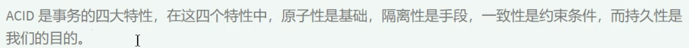

## 事务的状态

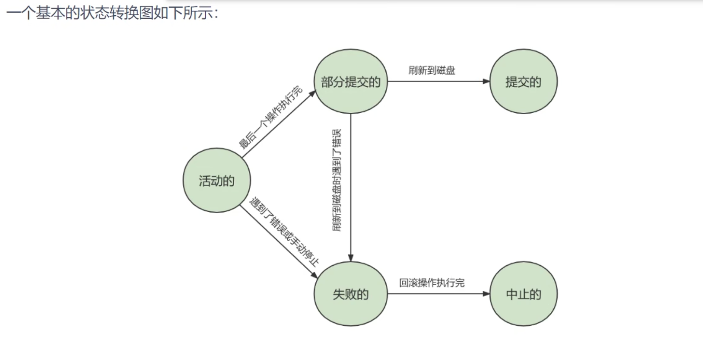

## 显式事务和隐式事务

### 显式事务

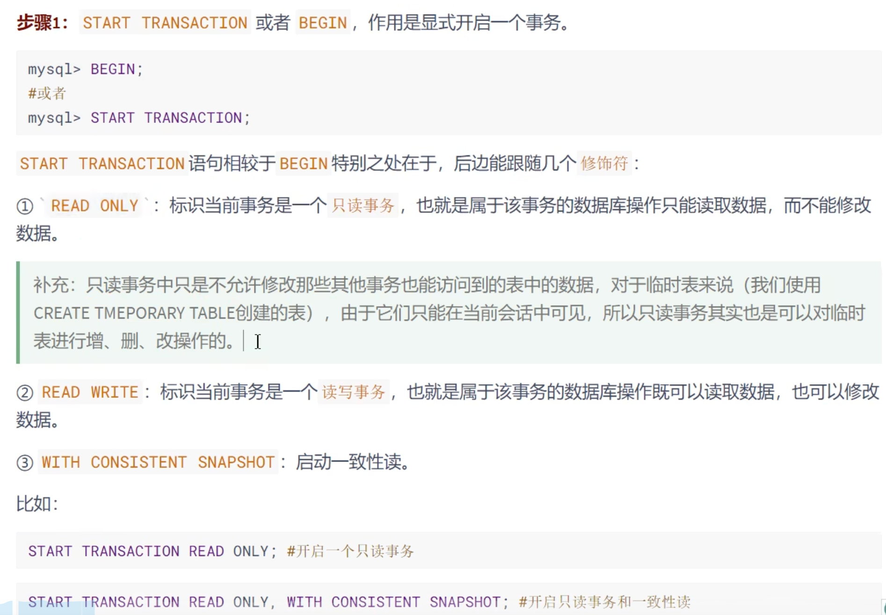

### 隐式事务

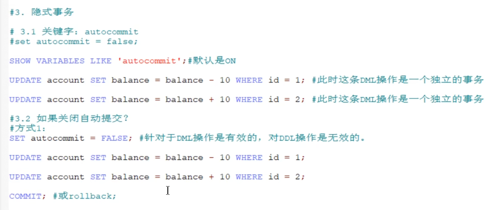

#### 隐式提交的情况

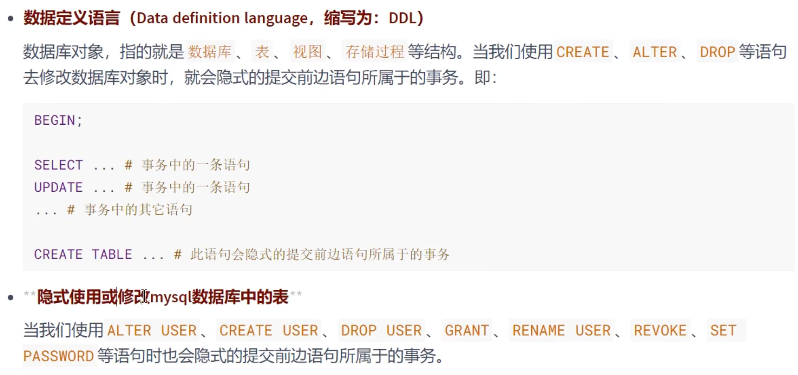

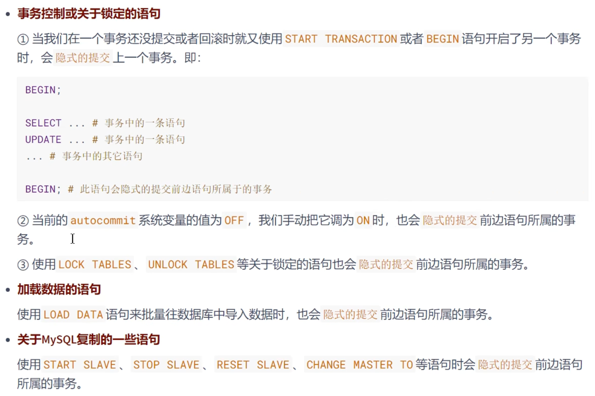

## 事务分类

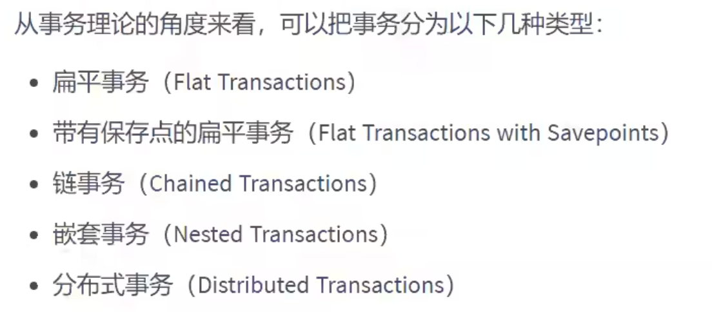

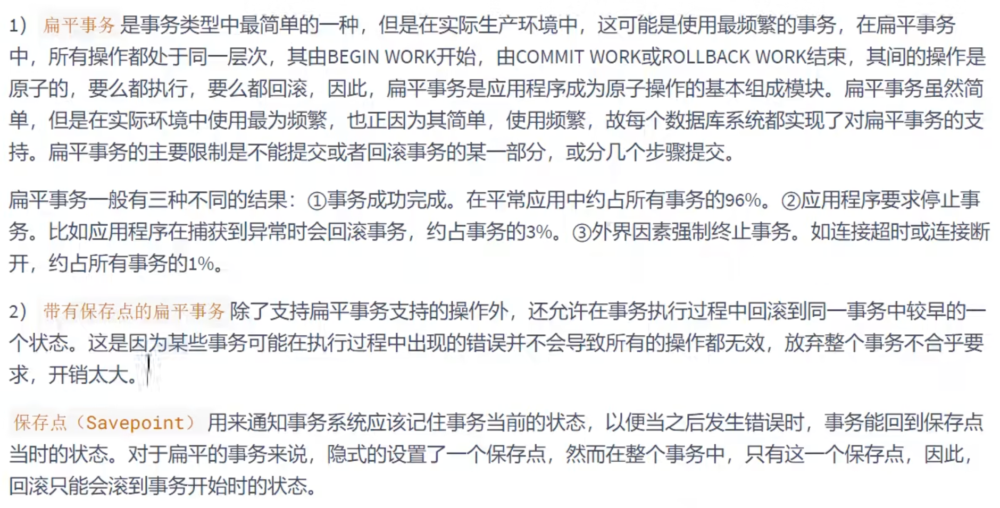

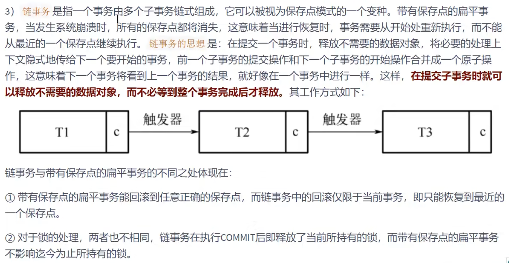

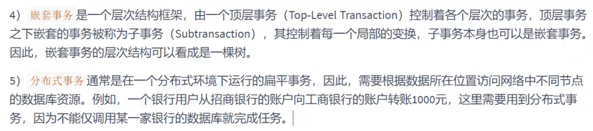

从查询和修改的角度，事务可以分为查询事务（只包含查询语句）和更新事务（至少存在一条修改语句）
