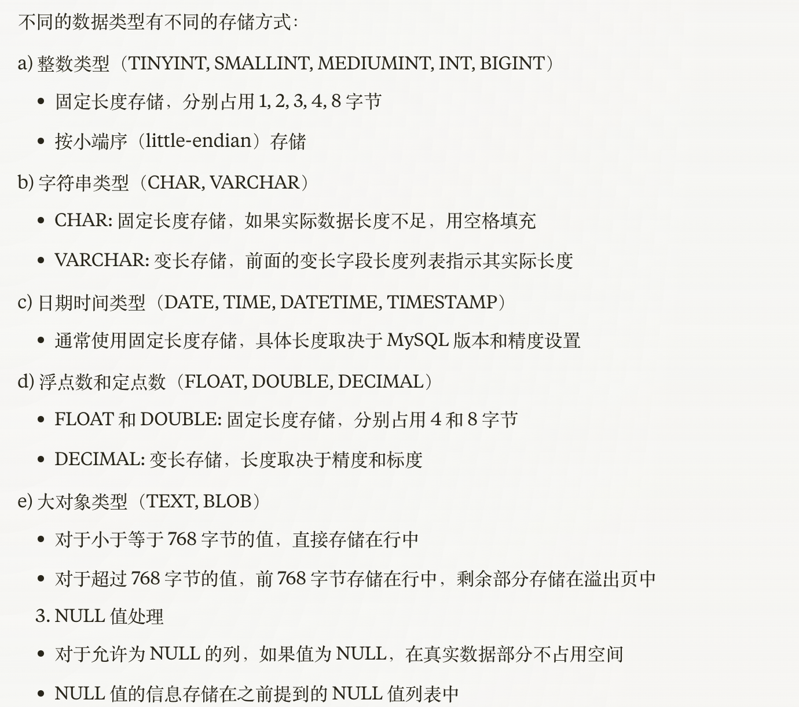

+++
title = "数据类型"
weight = 80
type = "docs"
layout = "page"
+++

## 数据类型

### 整型（TINYINT, SMALLINT, MEDIUMINT, INT, BIGINT）

### 字符串类型（CHAR, VARCHAR）

### 日期类型（DATE, TIME, DATETIME, TIMESTAMP）

### 浮点数（FLOAT, DOUBLE, DECIMAL）

### 大对象（TEXT, BLOB）

### NULL 值

## 数据类型存储方式

