+++
title = "MVVC"
weight = 10
type = "docs"
layout = "page"
+++

# 简介

用于实现高并发和一致性读取的重要机制，特别是实现可重复读（REPEATABLE READ）和读已提交（READ COMMITTED）隔离级别，而无需使用锁。

只有 innoDB 存储引擎才支持

MVCC = 隐藏字段（保证并发控制） + Undo Log(保证多版本)+ ReadView（保证并发控制）

# 快照读、当前读

## **快照读**

当一个事务开始时，它会记录当前系统中活动事务的 ID，并将其作为一个快照。此后，所有的读取操作都会基于这个快照，从而确保读取到的数据是一致的，不会受到其他事务的影响。

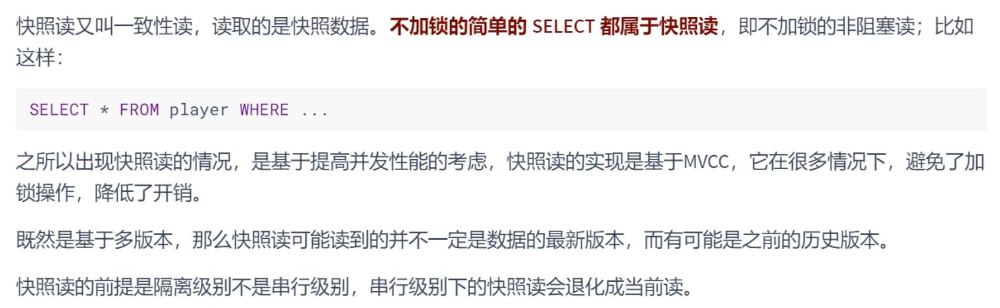

## 当前读

当前读直接读取最新版本的数据，并且需要加锁以确保数据的一致性和隔离性

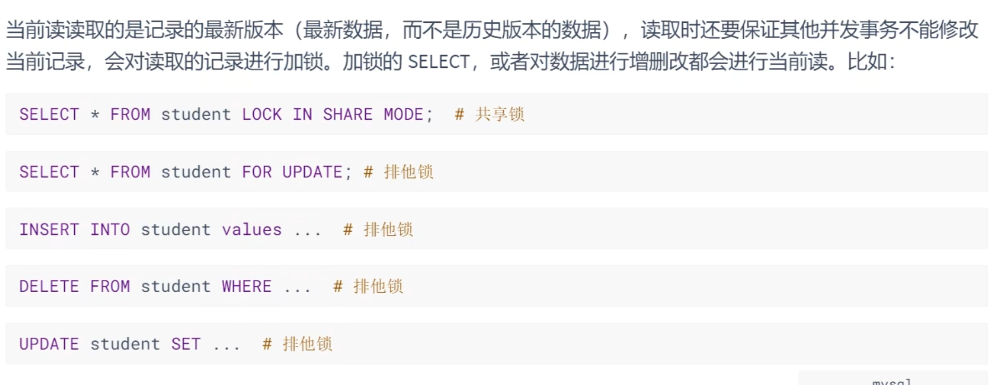

# ReadView

MVCC 实现依赖于：隐藏字段、Undo Log、ReadView

隐藏字段

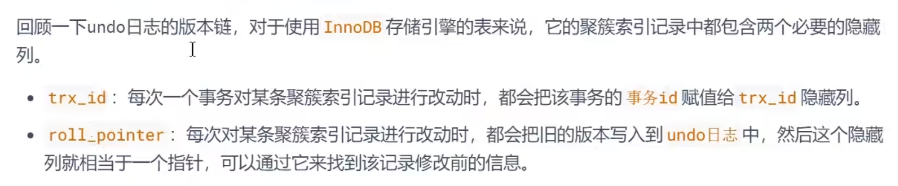

Undo Log 版本链

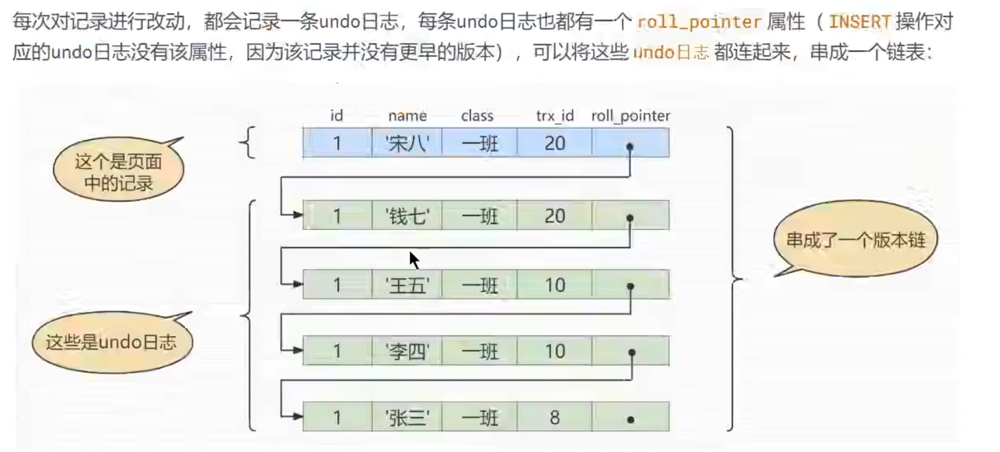

## ReadView 是什么

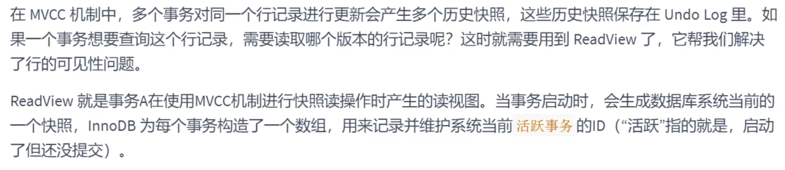

## 设计思路

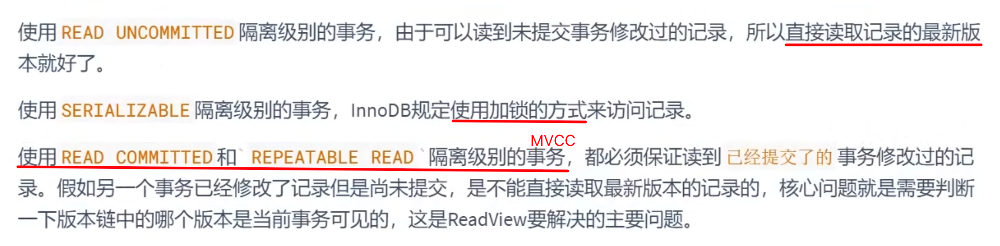

ReadView 中包含的重要内容

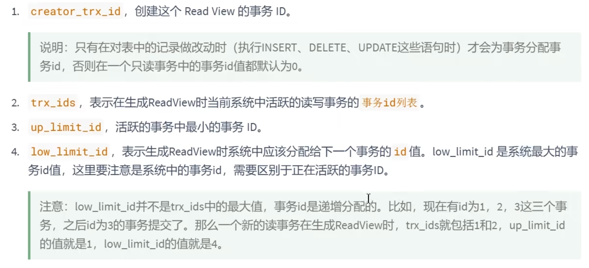

## 判断记录的某个版本是否可见的规则

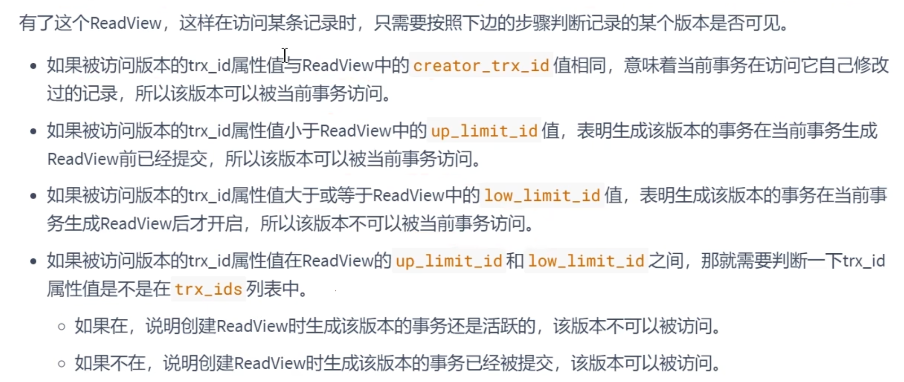

### 重新整理一下规则：

1. 如果**记录的 trx_id 小于 up_limit_id**，说明该记录在 ReadView 创建之前就已经提交，因此该记录版本对当前事务可见。
2. 如果**记录的 trx_id 大于等于 low_limit_id，**说明该记录在 ReadView 创建之后才开始，因此该记录版本对当前事务不可见。
3. 如果**记录的 trx_id 在 trx_ids 列表中**，说明该记录是由一个未提交的事务创建的，因此该记录版本对当前事务不可见
4. 如果**记录的 trx_id 等于当前事务 creator_trx_id**，说明该记录是由当前事务自身创建或修改的，因此该记录版本对当前事务可见。
5. 如果**记录的 trx_id 介于 up_limit_id 和 low_limit_id 之间，并且不在 trx_ids 列表中**，说明该记录在 ReadView 创建之前已经提交，因此该记录版本对当前事务可见。

## MVCC 整体流程

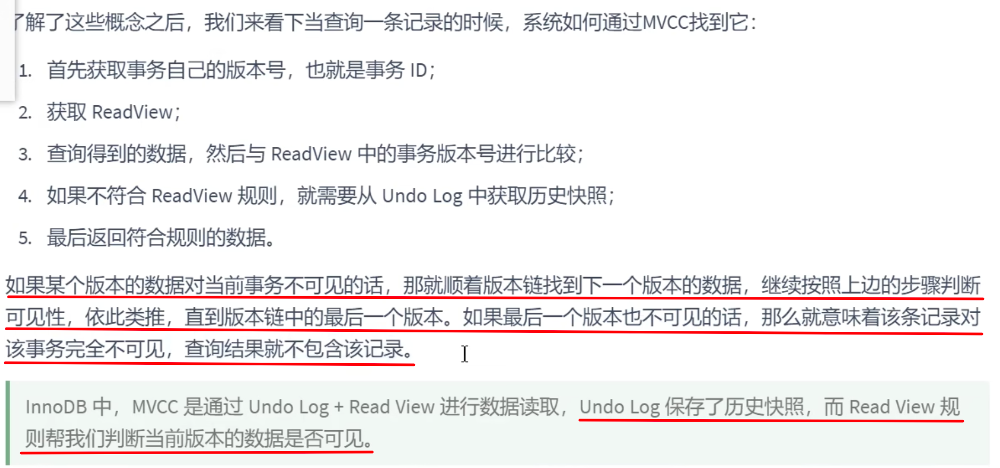

隔离级别为 Read Committed 时，事务中的**每次读（select）都会重新获取一次 ReadView。**这样会导致不可重复读、幻读问题（留给 Repeatable Read 隔离级别解决）

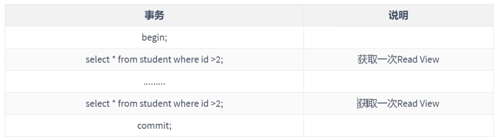

隔离级别为 Repeatable Read 时，事务中**只会初次读（select）获取一次 ReadView，后续的读（select）均复用此 ReadView。**这就区别了 Read Committed 级别，解决了不可重复读和幻读问题

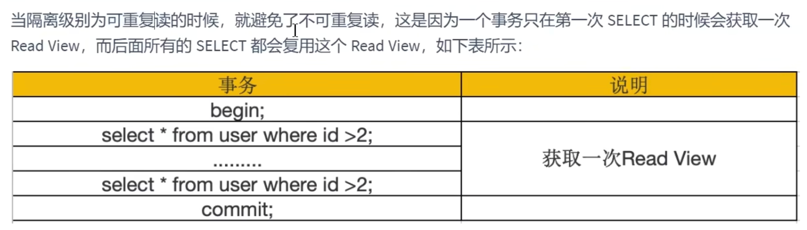

# 示例理解

## 在  Read Committed 级别下

解决了脏读，存在不可重复度和幻读

### 如何解决了脏读？

事务每次读时都获取 ReadView

### 为什么存在不可重复度？

## 在 Repeatable Read 级别下

解决了脏读、不可重复度、幻读

### 如何解决了不可重复度？

源于事务仅初次读时获取 ReadView

### 如何解决了幻读？

源于事务仅初次读时获取 ReadView。

而在  Read Committed 级别下事务每次读时都获取 ReadView，解决不了幻读问题

# 小结

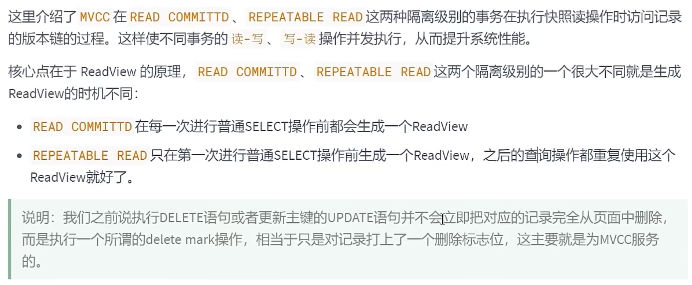

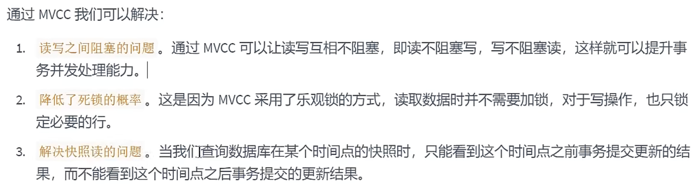
