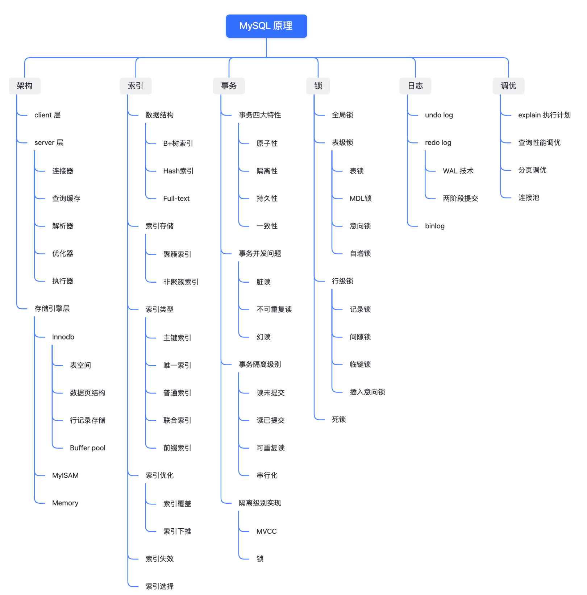

+++
title = "高级"
weight = 20
type = "docs"
layout = "section"
+++

Explain 分析

[https://relph1119.github.io/mysql-learning-notes/#/mysql/15-%E6%9F%A5%E8%AF%A2%E4%BC%98%E5%8C%96%E7%9A%84%E7%99%BE%E7%A7%91%E5%85%A8%E4%B9%A6-Explain%E8%AF%A6%E8%A7%A3%EF%BC%88%E4%B8%8A%EF%BC%89](https://relph1119.github.io/mysql-learning-notes/#/mysql/15-%E6%9F%A5%E8%AF%A2%E4%BC%98%E5%8C%96%E7%9A%84%E7%99%BE%E7%A7%91%E5%85%A8%E4%B9%A6-Explain%E8%AF%A6%E8%A7%A3%EF%BC%88%E4%B8%8A%EF%BC%89)

[表数据结构](https://iqop6is7zk9.feishu.cn/wiki/Gb5rwH99giqRQrkVOAvciQbrnCc)

[索引](https://iqop6is7zk9.feishu.cn/wiki/GXa8wjhd2i2EudkVkg5cUsg3nfd)

[事务](https://iqop6is7zk9.feishu.cn/wiki/OdBmwgYIriRkkakSzxEc2z4CnCc)

[日志](https://iqop6is7zk9.feishu.cn/wiki/Bt7xwqAAyiTwrhkp9XvcwSd6n3e)

[锁](https://iqop6is7zk9.feishu.cn/wiki/G90fwqR4wi75s9kpDNLcknMjnud)

[MVVC](https://iqop6is7zk9.feishu.cn/wiki/RTXrwXlFBi2UEEkW3tqcJuT3nKf)

[主从复制、读写分离](https://iqop6is7zk9.feishu.cn/wiki/X8CAwqsluipTIZkTozecumlXnkh)

[临时记录](https://iqop6is7zk9.feishu.cn/wiki/HEn1w5UxBiMV0XkkDdXcGfiTnte)
