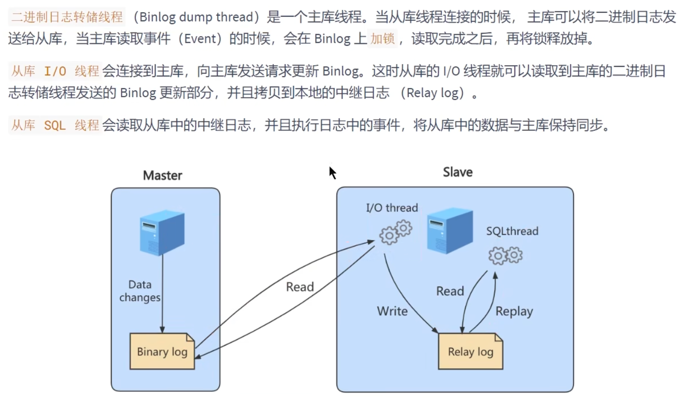
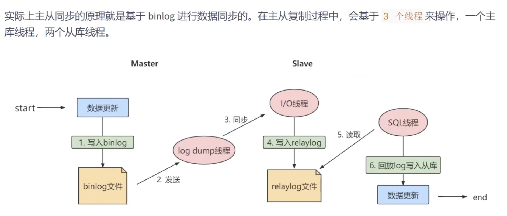
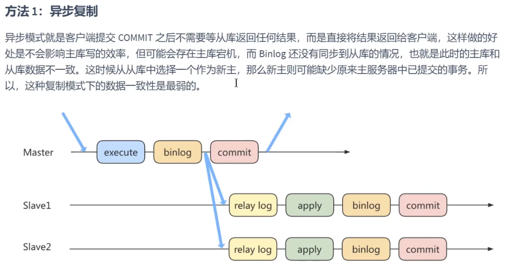
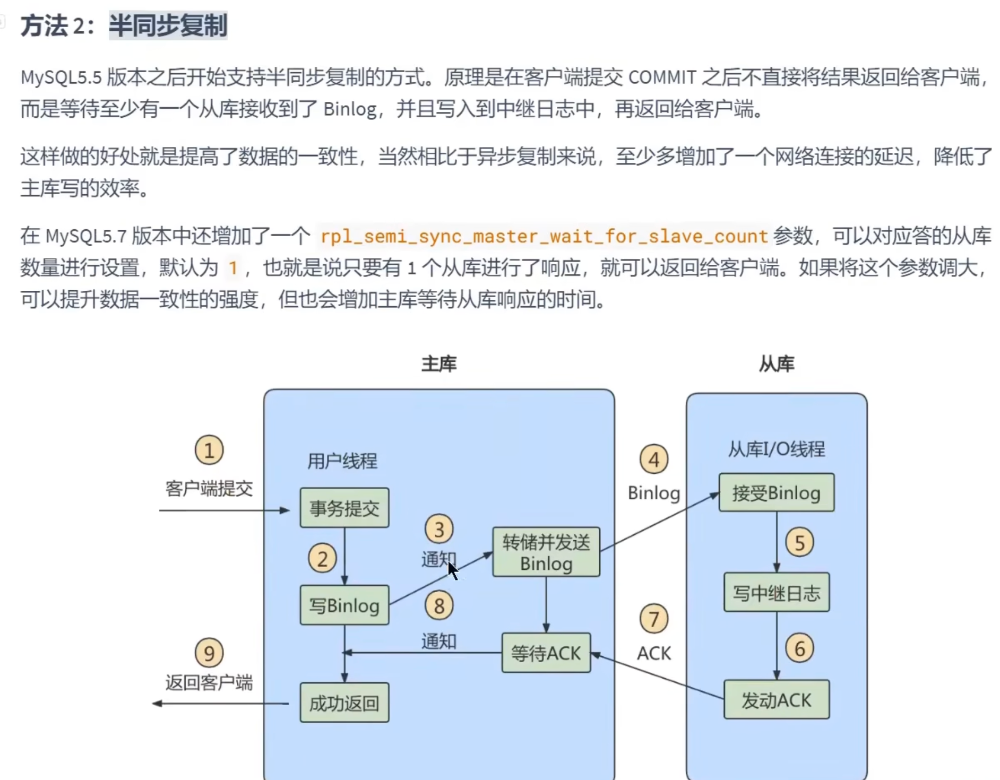
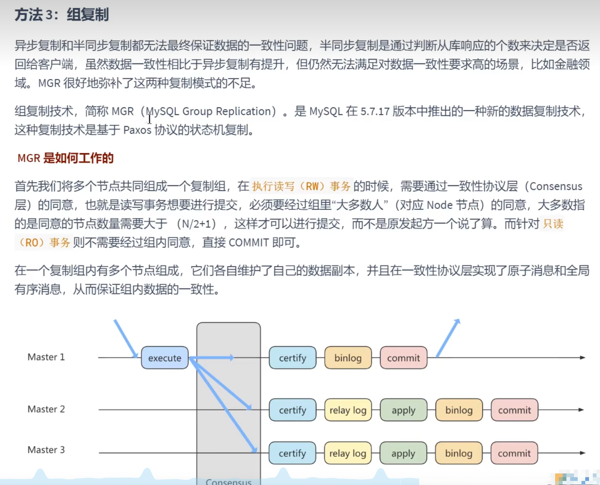

+++
title = "主从复制"
weight = 30
type = "docs"
layout = "page"
+++

# 作用

可以提高数据库的吞吐量

1. 读写分离

1. 数据备份

**热备份机制**，在主库正常运行情况下进行的备份，不会影响到服务

1. 高可用

通过数据备份的**冗余机制**，达到高可用

高可用性程度的衡量：正常可用时间 / 总时间。如全年可用率达 99.999% 需系统在一年中不可用时间不得超过 365*34*60*(1 - 99.999%) = 5.256 分钟

# 主从复制原理

## 原理剖析

## 基本原则

# 主从架构搭建

...

主配置

从配置

# 延迟复制

设置延迟复制时间 change master to master_delay=N（单位秒）

作用：

1. 延迟测试
2. 旧数据查询

# 同步数据一致性问题

MGR 采用了 **paxos** 一致性算法

# Mysql 中间件
