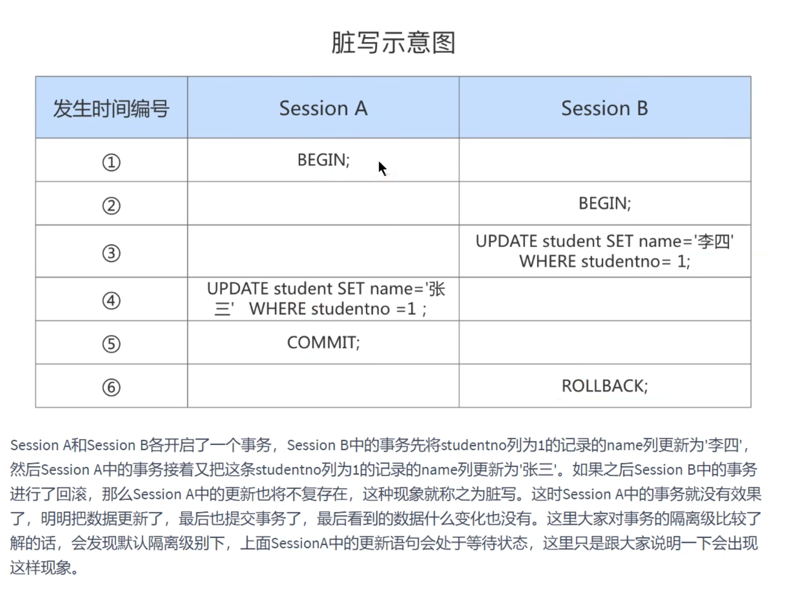
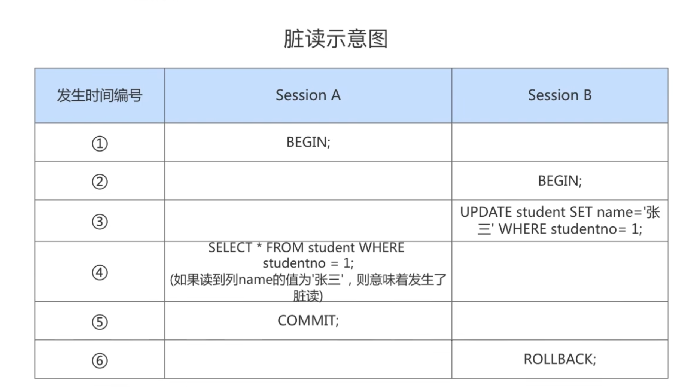
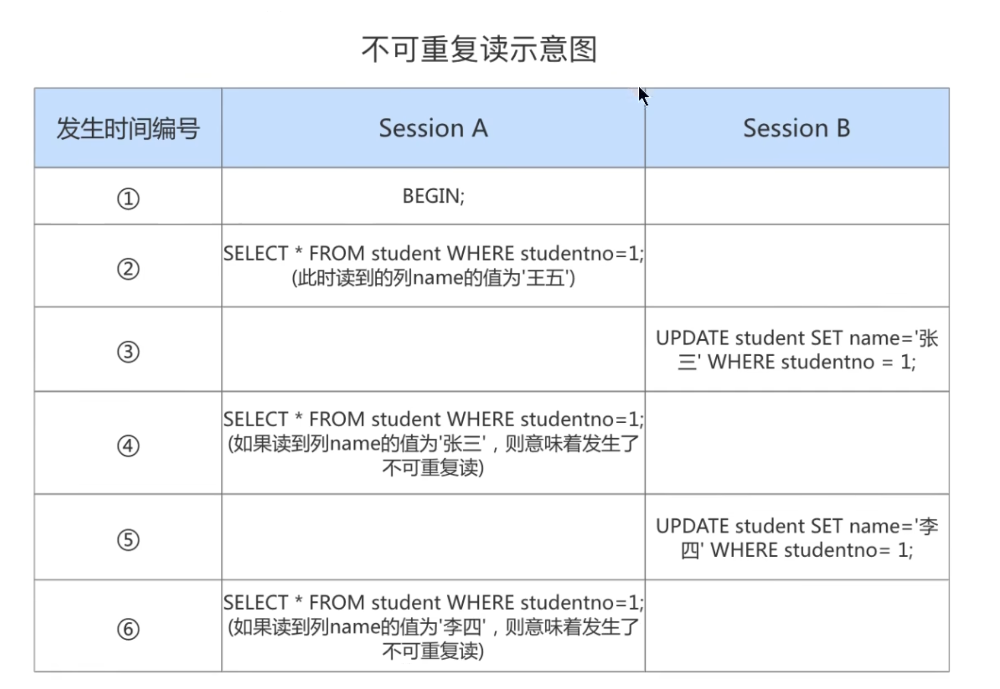
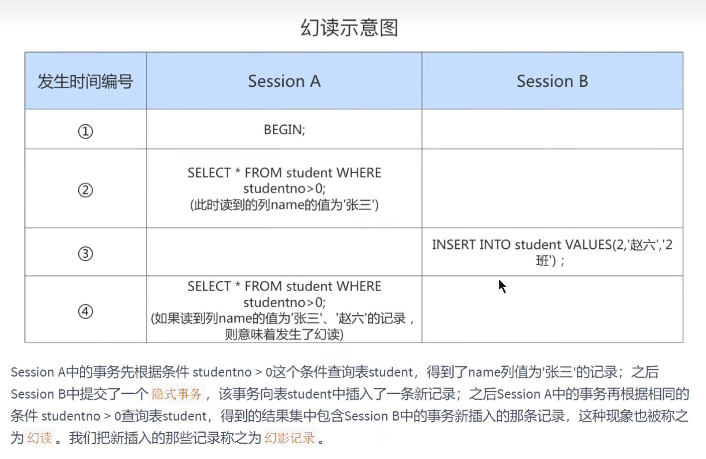
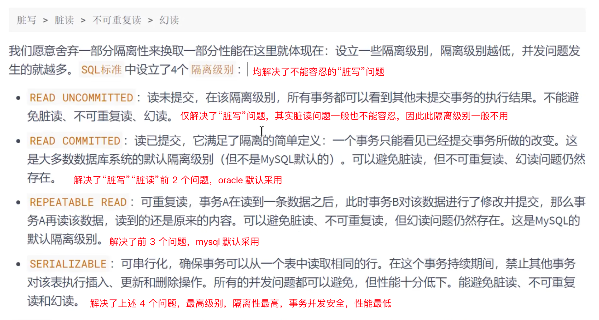
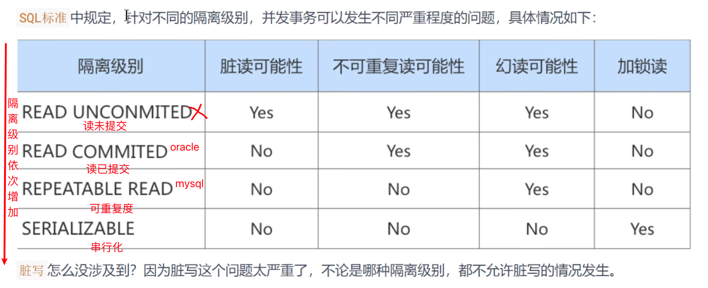
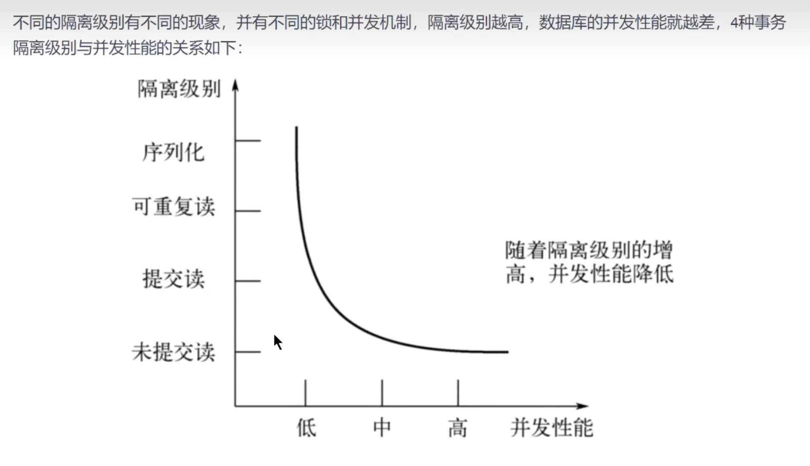

+++
title = "事务"
weight = 40
type = "docs"
layout = "page"
+++

[https://relph1119.github.io/mysql-learning-notes/#/mysql/19-%E4%BB%8E%E7%8C%AB%E7%88%B7%E8%A2%AB%E6%9D%80%E8%AF%B4%E8%B5%B7-%E4%BA%8B%E5%8A%A1%E7%AE%80%E4%BB%8B](https://relph1119.github.io/mysql-learning-notes/#/mysql/19-%E4%BB%8E%E7%8C%AB%E7%88%B7%E8%A2%AB%E6%9D%80%E8%AF%B4%E8%B5%B7-%E4%BA%8B%E5%8A%A1%E7%AE%80%E4%BB%8B)

## 事务的隔离级别

权衡事务隔离性和一致性

事务的隔离性是由**锁**来保证的

## 数据并发问题

注意：指的是在事务并发执行过程中，事务之间互相干扰发生的现象，强调的是在事务范围内导致的不一致性问题

### 脏写 Dirty Write

事务 A 修改了事务 B 修改但未提交的数据，即发生的脏写

### 脏读 Dirty Read

事务 A 读取了 事务 B 修改但未提交的数据

之后，若 B 回滚，则 A 读取的内容是临时且无效的

### 不可重复读  Non-Repeatable Read

事务 A 读取了数据，事务 B 更新该数据并提交，事务 A 再次读取了该数据，两次结果不一致

**事务 A 多次读取同一数据，但事务 B 在事务 A 多次读取的过程中，对数据作了更新并提交，导致事务 A 多次读取同一数据时，结果 不一致。**

### 幻读 Phantom

事务 A 读取某字段，事务 B **插入（强调的是插入）**了新的行，A 再次读取时多出了数据

## SQL 中的四种隔离级别

按严重性排序：脏写 > 脏读 > 不可重复读 > 幻读

注意：在 mysql 中的 repetable read 级别，已经解决了幻读的问题，即幻读可能性为 No

SHOW VARIABLES LIKE 'transaction_isolation';
