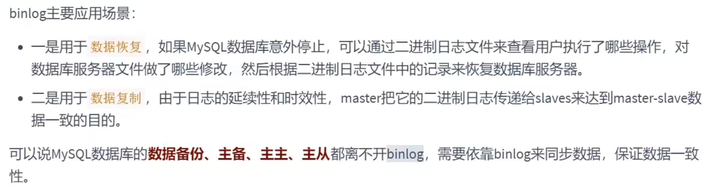
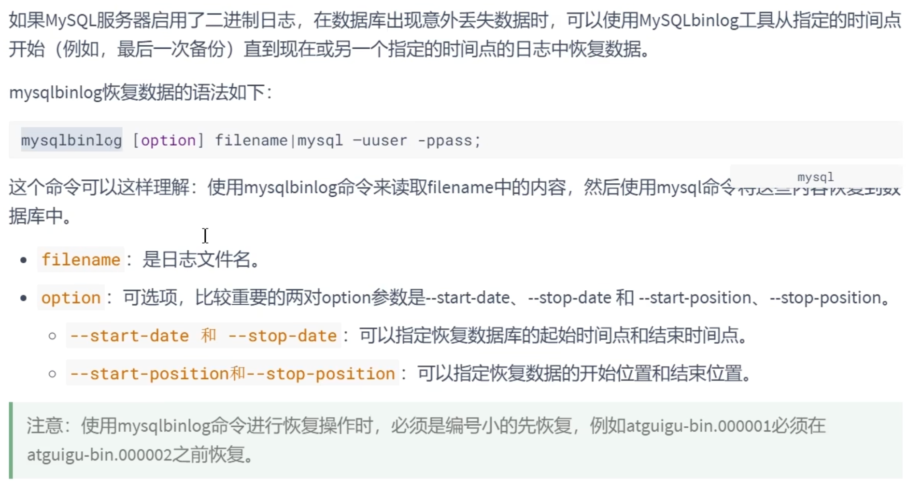
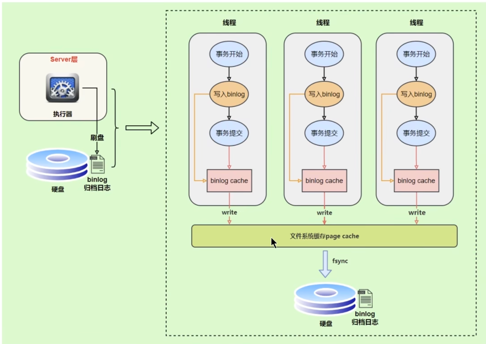
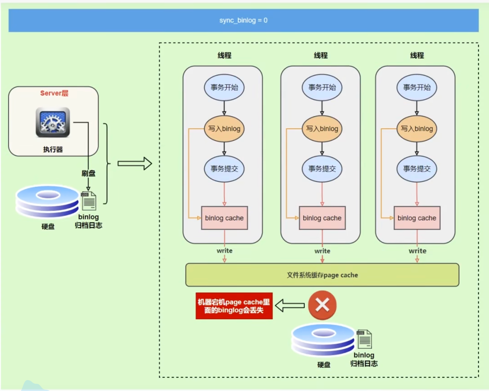
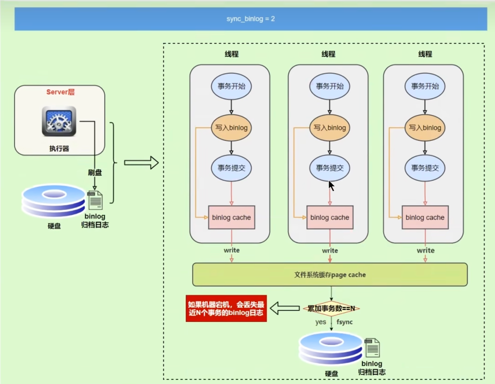
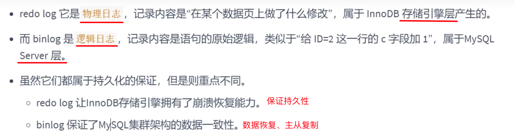
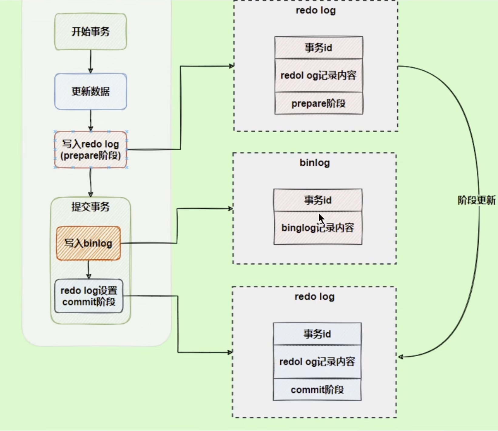
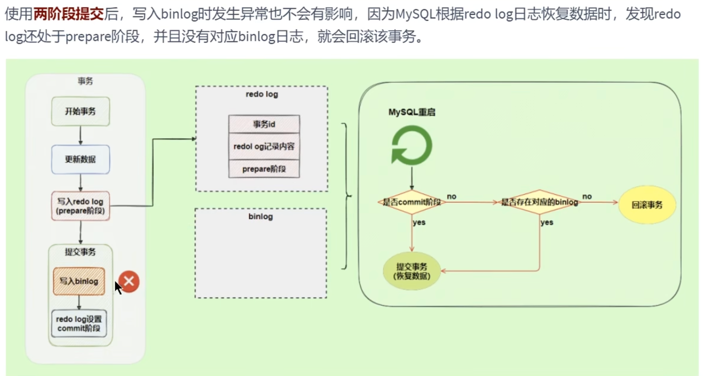

+++
title = "Bin Log"
weight = 10
type = "docs"
layout = "page"
+++



```bash
# 查看系统 binlog 文件的配置，如路径、索引文件名、日志文件名称等
show variables like 'log_bin%';

# 查看所有的 binlog 文件列表
show binary logs

# 结束上一个并生成新的 binlog 文件，后续都在新的 binlog 文件记录
flush logs
```

## 查看 binlog 文件内容

1. 使用 mysqlbinlog 命令

```bash
# 主机上的命令
mysqlbinlog -v "/var/lib/mysql/binlog.000016"

其他参数
--base64-output=decode-rows
--
```

1. show binlog events

```bash
# mysql 客户端控制台命令
show binlog events in "/var/lib/mysql/binlog.000016"
```

## Binlog 格式

查看

```bash
SHOW VARIABLES LIKE 'binlog_format';
```

三种格式

- Statement：记录 SQL 逻辑语句
- Row：记录真实修改的数据行
- Mixed：前两者混用

## 使用 binlog 日志恢复数据



### 按照位置段恢复

```bash
# 通过 show binlog events in "/var/lib/mysql/binlog.000016" 查询到 position
mysqlbinlog --start-position=312 --stop-position=1347 --database=<database-name> /var/lib/mysql/binlog.000016 | grep mysql -u root -p <your-password> -v <database-name>
```

### 按照时间段恢复

```bash
# 通过 mysqlbinlog -v "/var/lib/mysql/binlog.000016" 查到时间戳
mysqlbinlog --start-datetime="2024-02-12 15:33:00" --stop-datetime="2024-02-12 16:00:00" --database=<database-name> /var/lib/mysql/binlog.000016 | grep mysql -u root -p <your-password> -v <database-name>
```

## 删除日志

### 配置自动删除

### 手动删除

1. Purge master logs to '<log-file-name>'   删除指定日志文件名**之前**的日志文件
2. Reset master 删除所有，慎用！

## 写入机制

事务执行过程中，也是会写 binlog cache，然后放到系统 page cache 中，最终刷盘



### 刷盘策略

sync_binlog=0



sync_binlog=1，此时事务执行完成立即同步刷盘，这样最安全，但性能最低

sync_binlog=2，每次提交事务先不刷盘，累积 N 个事务后一起刷盘，存在 N 个事务信息丢失的风险



## Binlog 与 Redo Log 对比



## 两阶段提交

Redo log 的两阶段提交，是为了解决事务 redo log 与 binlog 不一致问题

阶段一：Redo log 准备阶段

阶段二：Redo log 提交阶段

将写入 binlog 日志放在两阶段之间！即 **Redo log 准备 -> 写入 binlog 日志 -> Redo log 提交**

简单理解就是：**当发现 Redo log 准备阶段无误，写入 binlog 日志出错，则回滚；若写入 binlog 日志正常，则提交事务**




