+++
title = "Undo 日志"
weight = 20
type = "docs"
layout = "page"
+++

## Undo 日志

### 如何理解 undo 日志

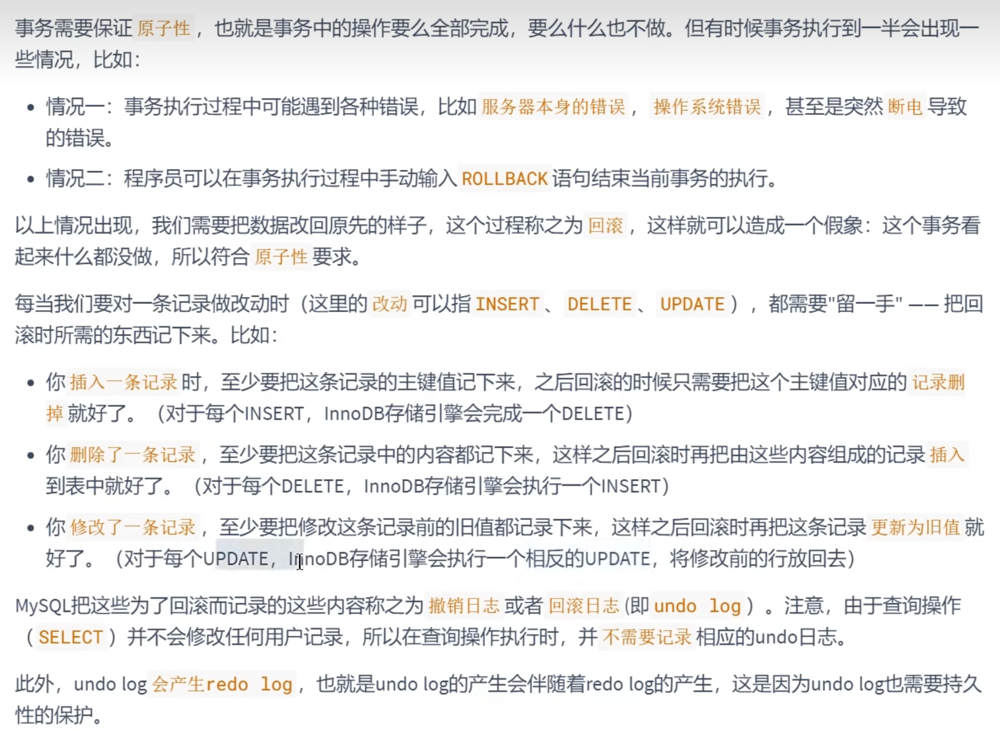

### undo 日志作用

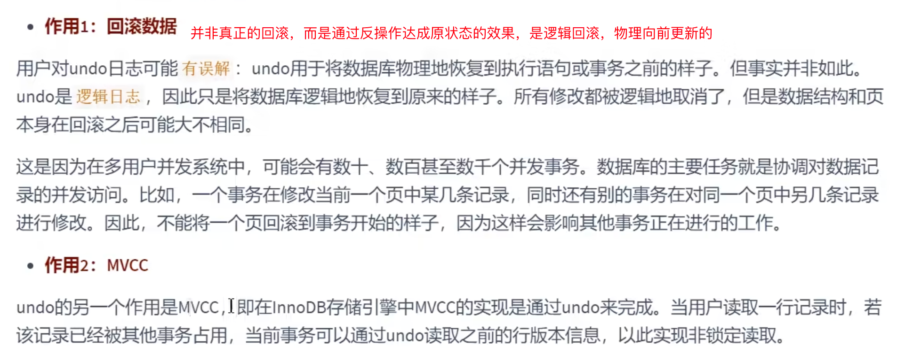

### undo 日志存储结构

#### 回滚段与 Undo 页

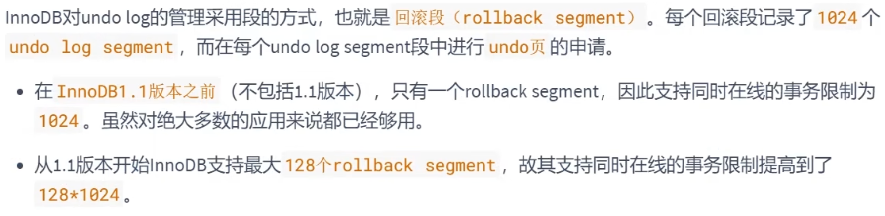

##### Undo 页的重用

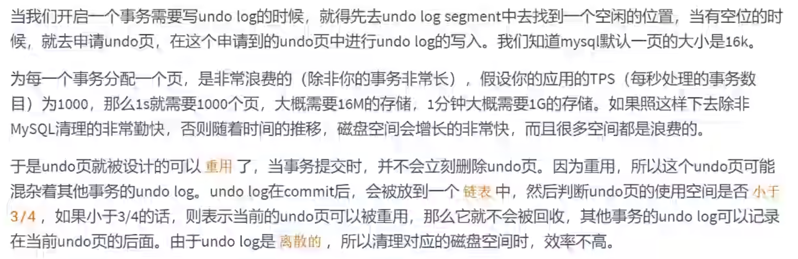

#### 回滚段与事务

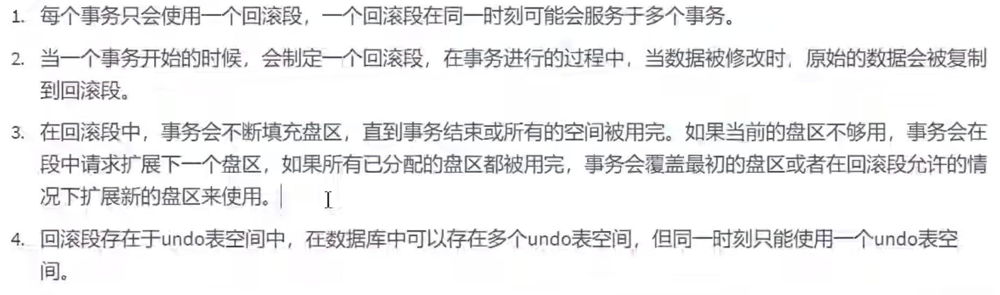

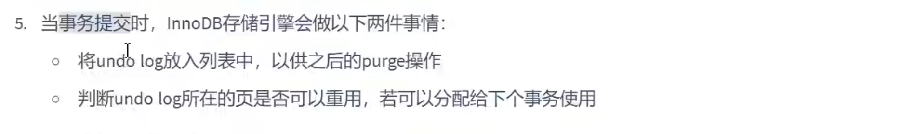

#### 回滚段中的数据分类

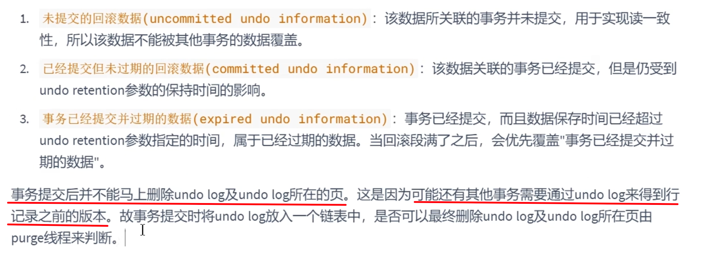

### undo 日志类型

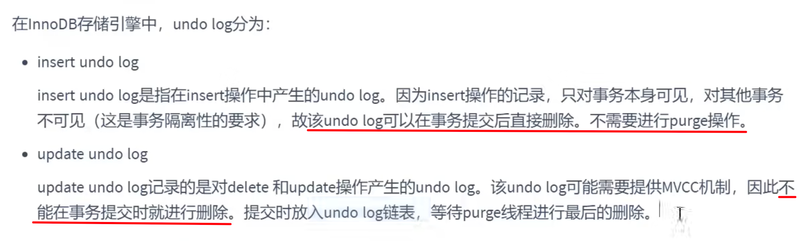

### undo 日志生命周期

#### 简要过程

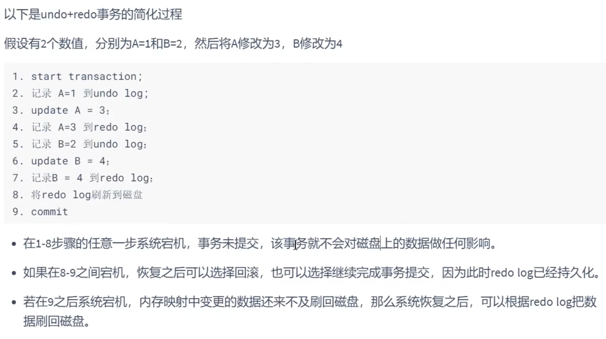

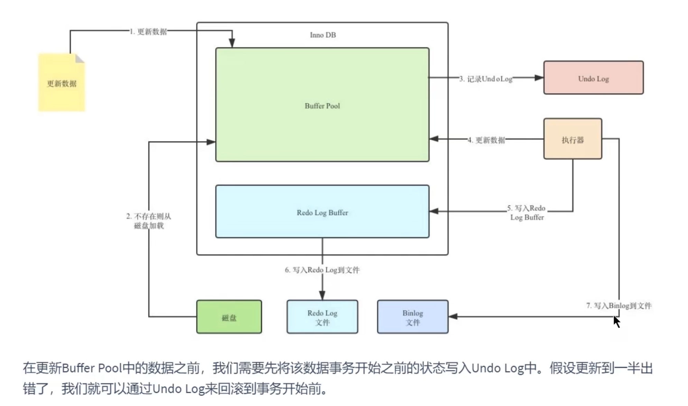

#### 详细过程

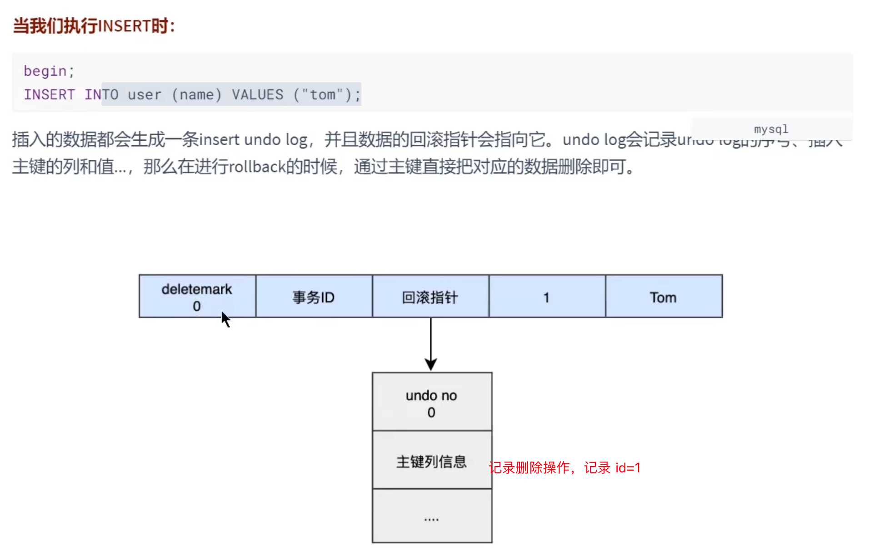

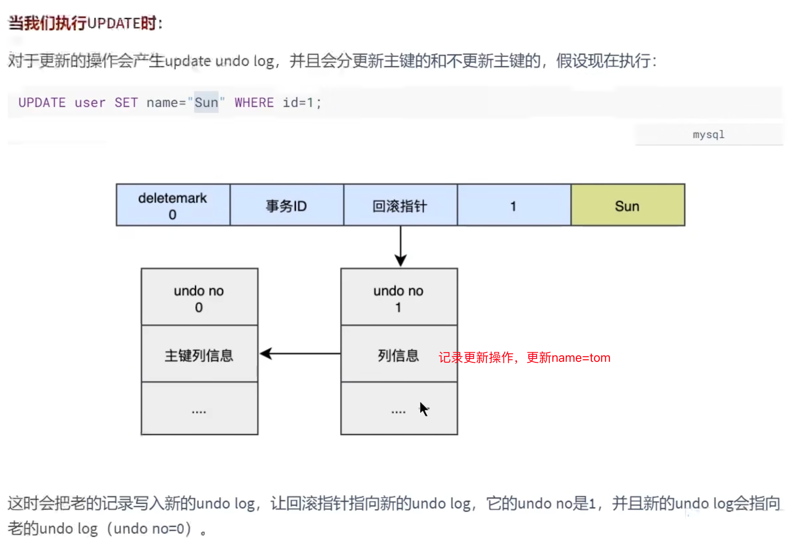

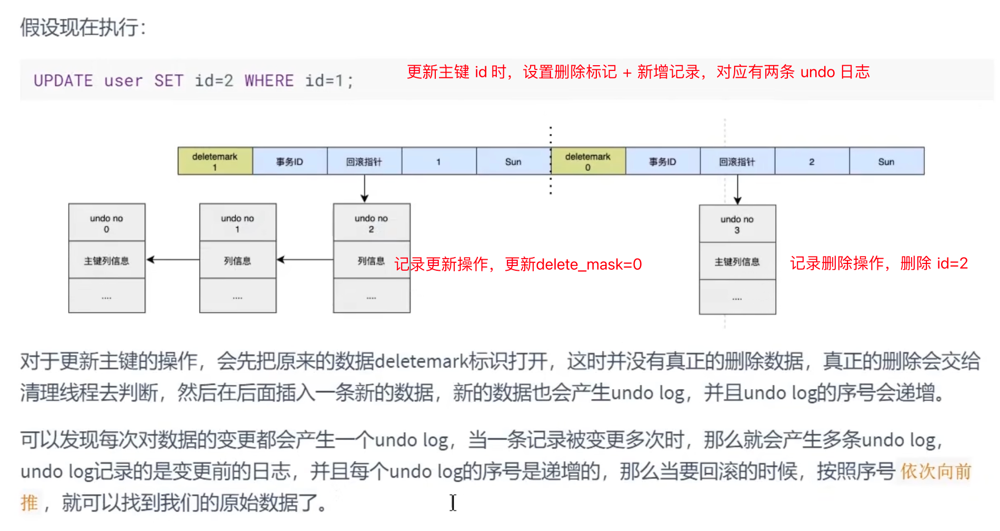

#### Undo 如何回滚

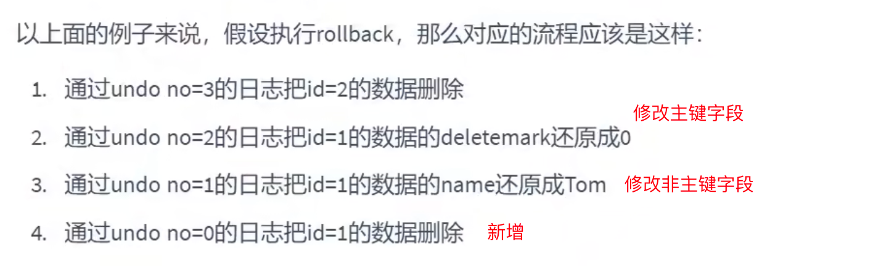

#### Undo 删除

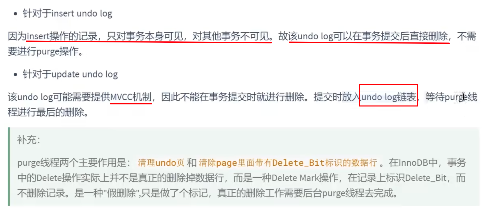

### 小结

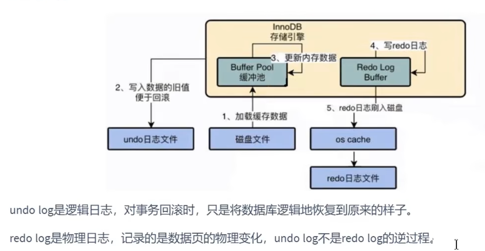
