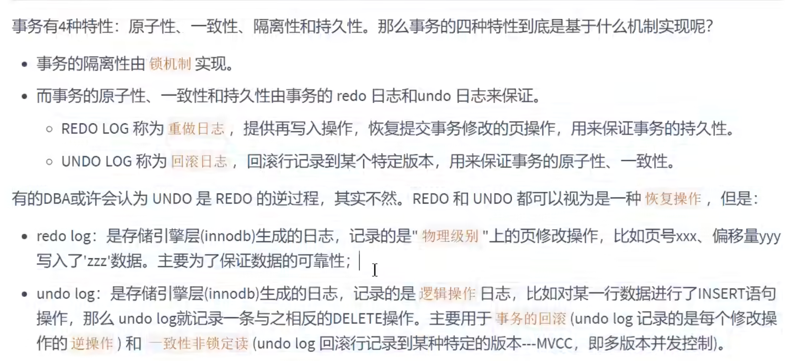

+++
title = "事务日志"
weight = 30
type = "docs"
layout = "section"
+++

事务的原子性、一致性、持久性是由**日志**来保证的

其中，redo log 提供再写入操作，恢复提交事务修改的页操作，用于保证持久性

Undo  log 回滚行记录到特定版本，用来保证原子性和一致性

## Redo 日志

[Redo 日志](https://iqop6is7zk9.feishu.cn/wiki/AUR4wrg2ViN5aXkEIMXcKaBhnmd)

## Undo 日志

[Undo 日志](https://iqop6is7zk9.feishu.cn/wiki/EizAwG8bniQGffkHtbEceK8xnac)

## Bin Log
