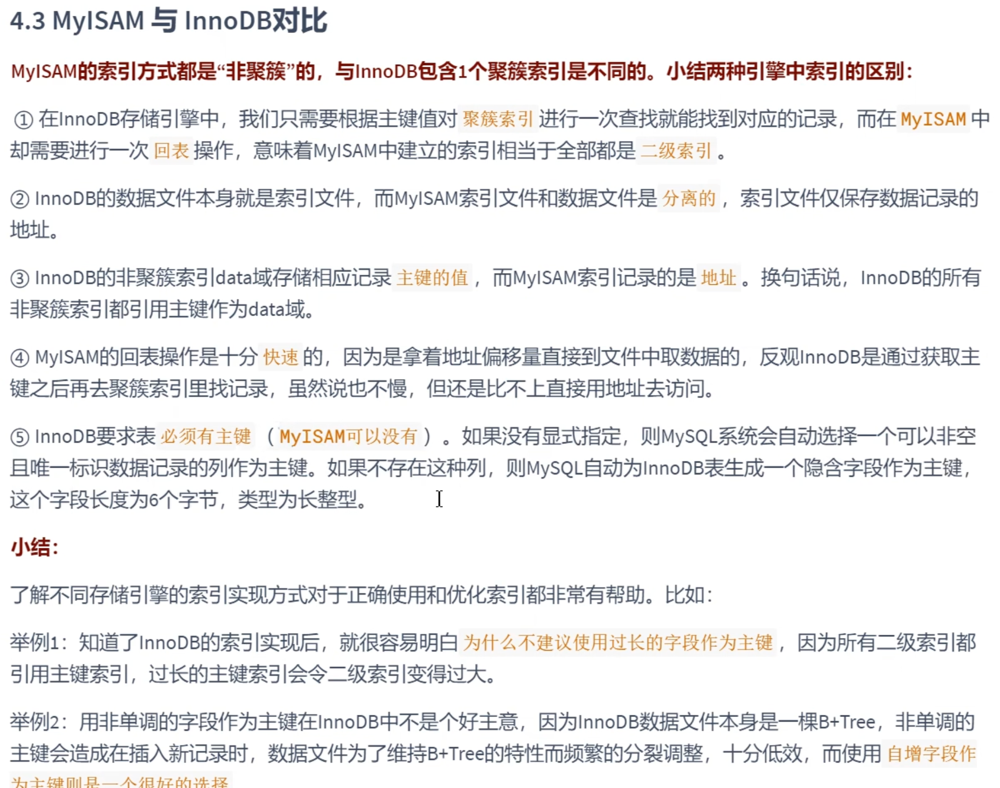
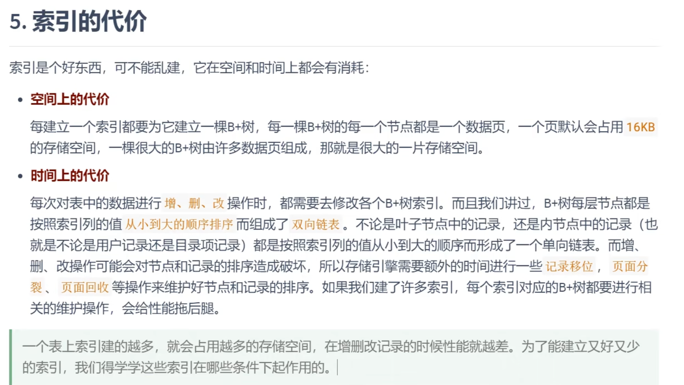
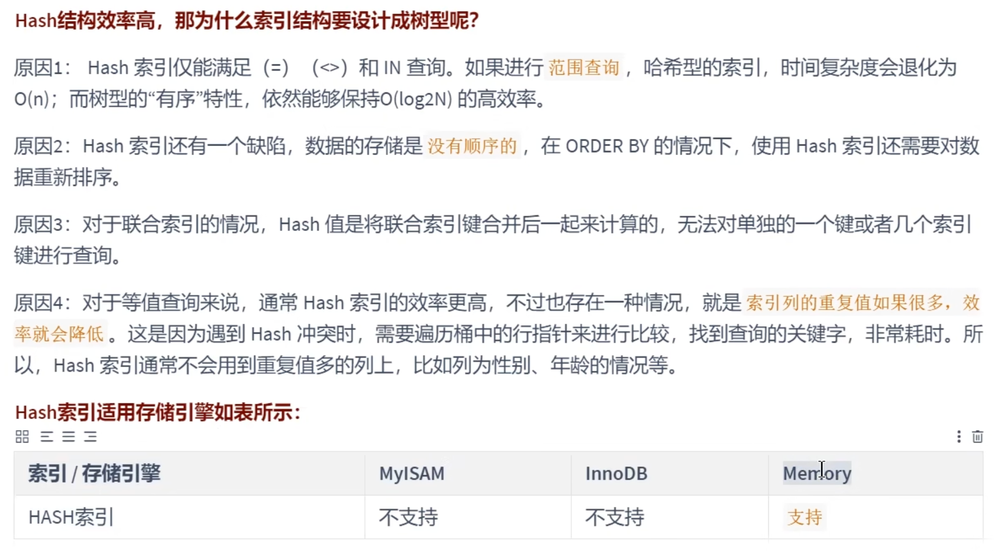
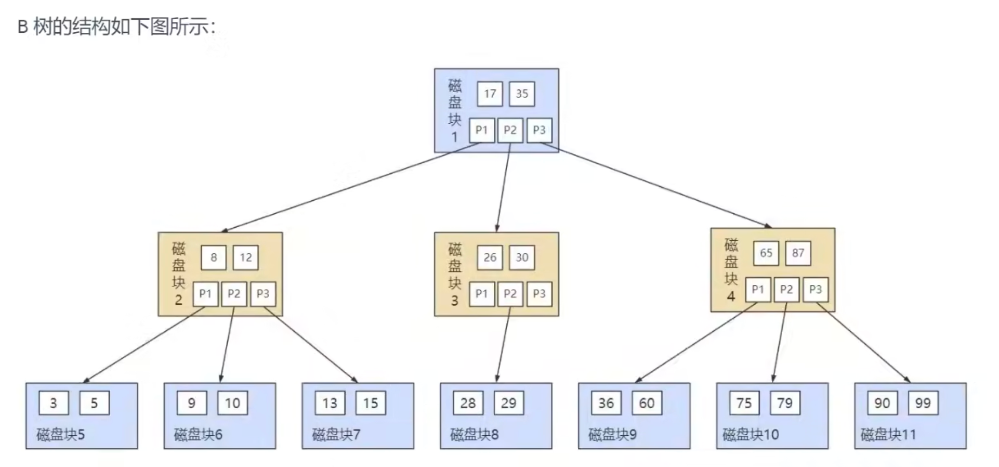
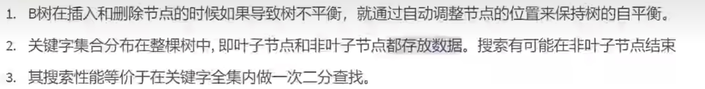
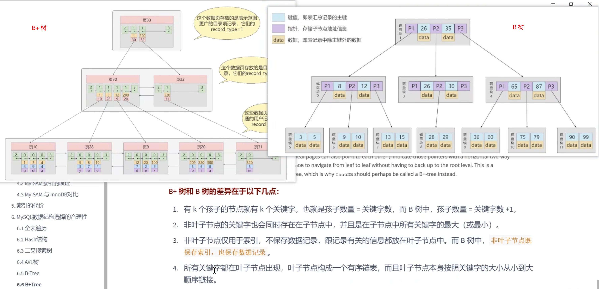
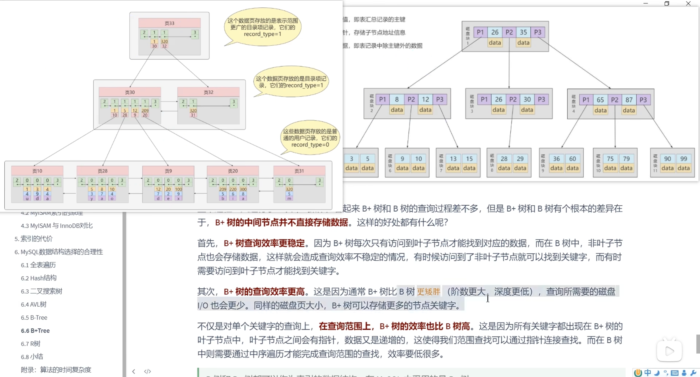
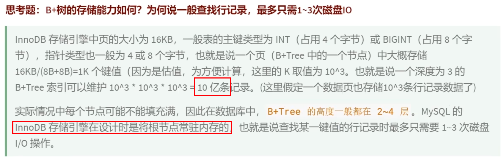
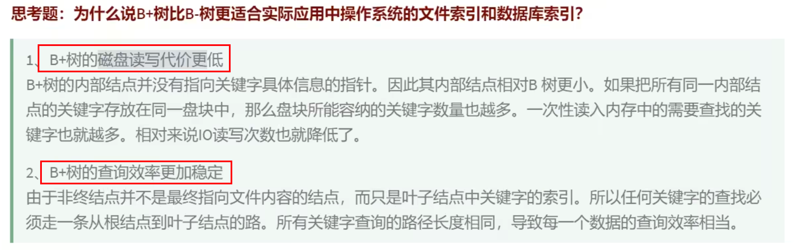

+++
title = "索引"
weight = 80
type = "docs"
layout = "page"
+++

## 两种存储引擎下索引的对比

## 索引的代价消耗

## 若采用其他数据结构

### hash 表

对于精确查找，确实效率高。但范围查询、重复值较多时均不行，不支持联合索引最左原则，不支持排序、模糊查询等；innoDB 支持了自适应哈希索引

### AVL 树

层数太高，磁盘 IO 次数会太多

### B 树

### B 树继续演变成 B+ 树

## 适合创建索引的情况

1. 唯一特性的字段

业务上具有唯一特性的字段或组合字段

唯一索引影响的 insert 速度损耗可忽略，但对查询的提升是明显的

1. 频繁作为 where 查询条件的
2. 经常 group by、order by 的字段，可分别建立索引，也可建立联合索引（先 group by 的字段、再 order by 的）
3. update、delete 的 where 条件字段
4. distinct 字段
5. 多表 join 连接时，连接表的数量不要超过 3；对 where 条件字段创建索引；对用于连接的字段创建索引，且该字段在关联的表中的类型必须一致
6. 对列类型小的字段创建索引（类型小指的是占有字节空间小），如能用 int 就不要用 bigint ，varchar(n) 的 n 值在允许内尽量最小。类型越小，查询时比较的速度就会越快，索引占有空间就会越少，数据页就能存放更多记录数量，从而减少磁盘 IO，可以缓存更多的数据页到内存；
7. 字符串前缀索引。需要注意前缀索引的字符数。通常通过比较 count(distinct (left(列名, 索引长度))) / count(*) 的值来确定，这个值越接近 1 越好，在能达到 0.8 0.9 的程度使索引长度尽量小；（alibaba 手册规定）在 varchar 上建立索引时，必须指定索引长度；注意，使用前缀索引，无法使用索引排序
8. 区分度高/散列性高的列适合建立索引。使用 select count(distinct a) / count(*) 计算区分度，越接近 1 越好，超过 33 % 就算比较高效的索引了。反例如性别等重复性极高的枚举字段就不适合建立索引
9. 最频繁的列放在联合索引的左侧
10. 在多个字段都需要创建索引的时候，联合索引优于单值索引

## 限制索引的数目

单表不超过 6 个

占用空间，影响增删改

## 不适合创建索引的情况

1. where 中使用不到的字段
2. 表数据量较小
3. 大量重复数据的列，即区分度不高的列，如性别。当重复度达到 10 % 以上就不需要建立索引
4. 避免对更新频繁的表建立索引
5. 不建议对无序的值建立索引，如 身份证、uuid、md5 等哈希值、无序长字符串等
6. 不要定义冗余或重复的索引
