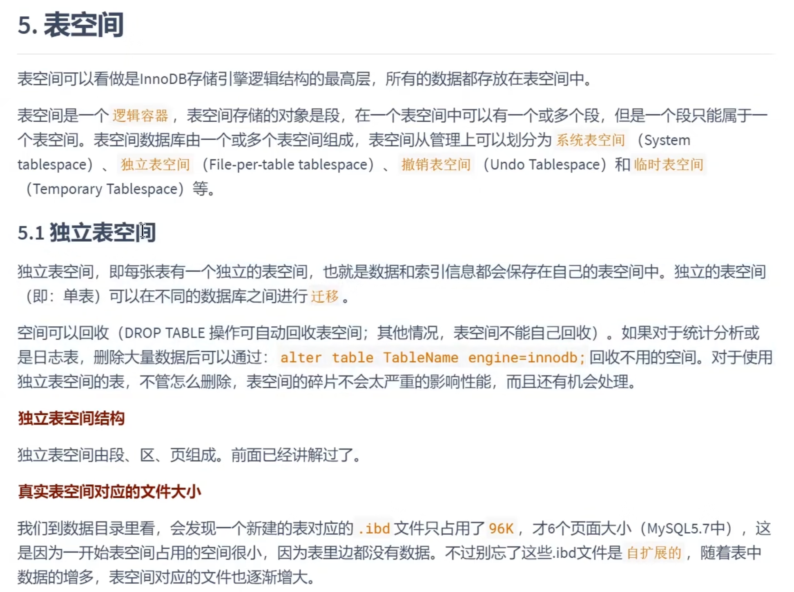
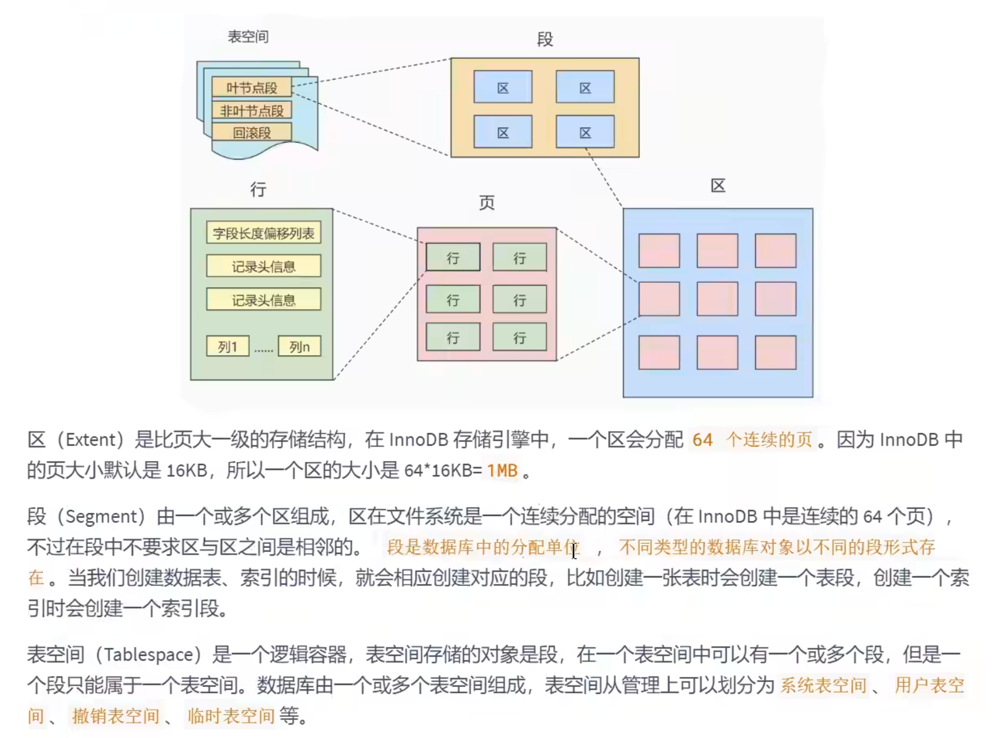
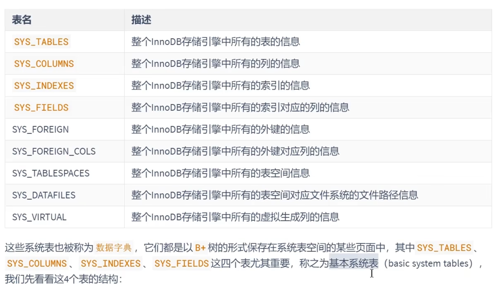
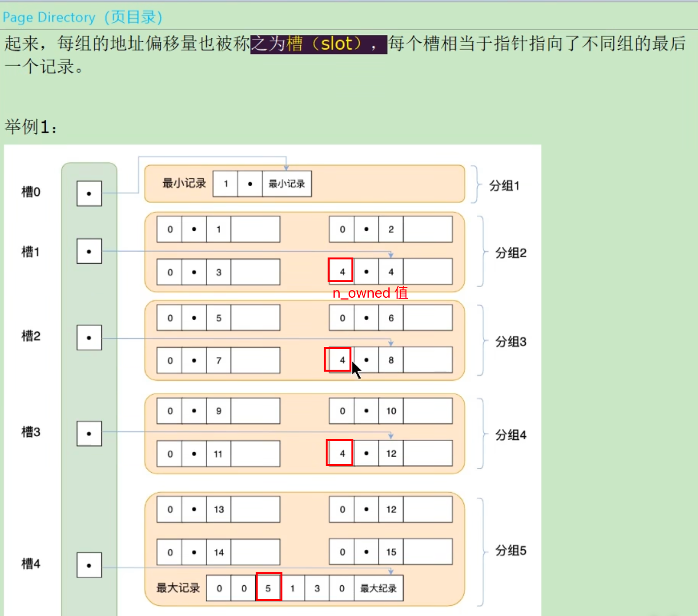
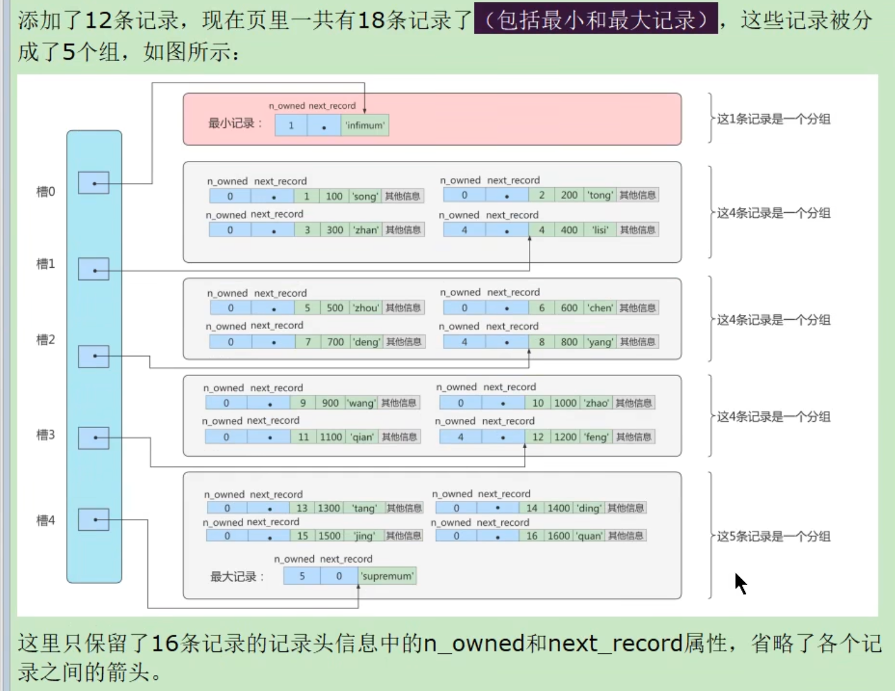
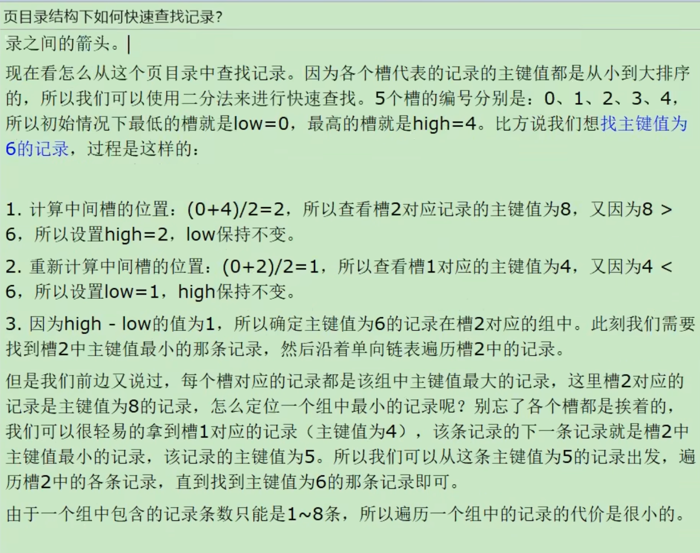
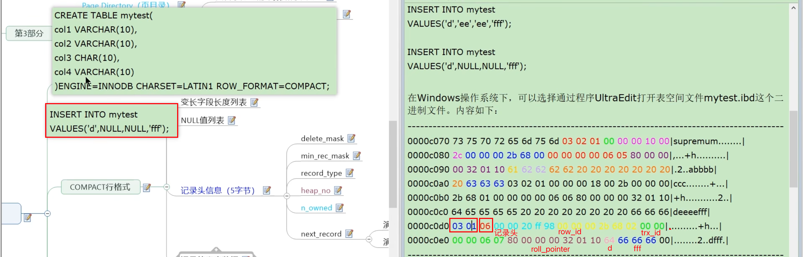
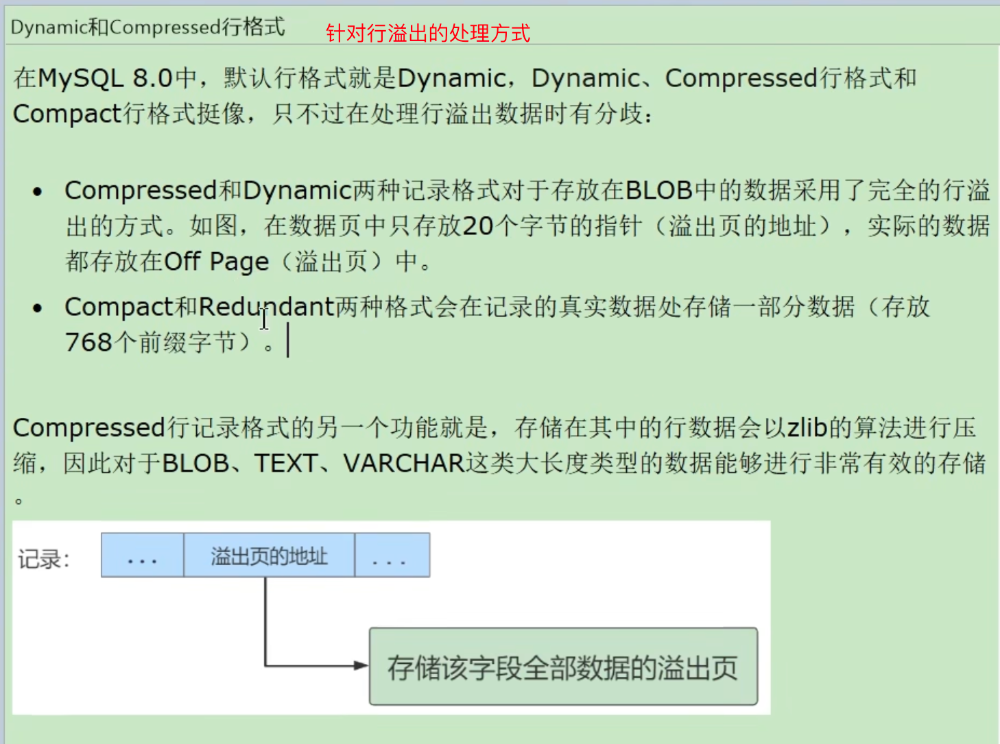
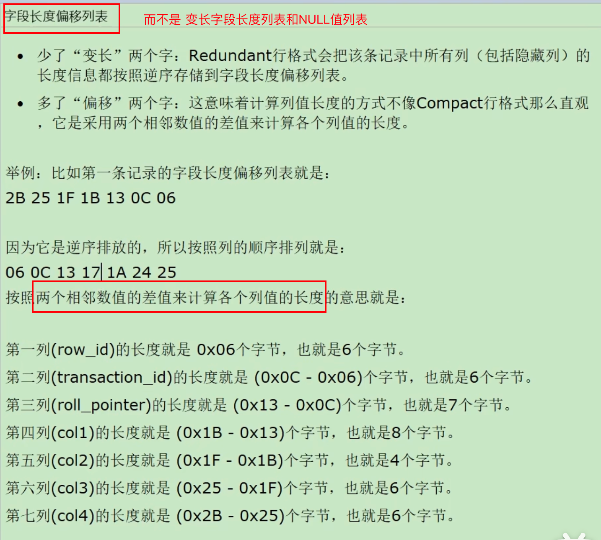

+++
title = "表数据结构"
weight = 90
type = "docs"
layout = "page"
+++

## 表空间

### 独立表空间

**独立表空间由段、区、页组成**，逻辑图如下：

### 系统表空间

## 段

多个区的集合

完整的说法是：某些零散的页面（碎片区）和一些完整的区的集合

### 数据段

叶子结点

### 索引段

非叶子结点

### 回滚段

## 区

保证一部分以链表形式链接的页在物理空间上也连续，增强随机 IO，提高 CPU 高速缓冲访问

### 区的分类

### 碎片区

## 页

### 第一部分：文件头、尾

### 第二部分：空闲空间、用户记录、最小最大记录

### 第三部分：页目录、页头部

参考 [https://www.bilibili.com/video/BV1iq4y1u7vj/?p=124&spm_id_from=pageDriver&vd_source=c3a22cc368bc8a404c4c78eb5a579a3c](https://www.bilibili.com/video/BV1iq4y1u7vj/?p=124&spm_id_from=pageDriver&vd_source=c3a22cc368bc8a404c4c78eb5a579a3c)

#### 页目录

是为了**解决单链表检索效率低**的问题。

将单链表节点（用户记录）划分为多组，每组对应页目录的一个槽，通过二分法先查询页目录的槽，然后根据槽定位某个组，再在每个组通过单链表的方式搜索（每组数量才几个，不会太慢）

通过页目录查找记录的过程

#### 页头部

## 行

row_format 格式类型

1. Redundant
2. Compact
3. Compressed
4. Dynamic

### Compact 行格式

#### 变长字段长度列表

存储可变长字段占用的字节长度

存储顺序为可变长字段的逆序

注意：当变长字段为 NULL 时，其长度不需要记录

#### NULL 值列表

对可为 NULL 值的字段是否为 NULL 的标记。

**占用的字节数**为大于字段个数（bit 位数）的最小字节数。字段个数 <= 8 个时采用 1 个字节；9～16 个时为 2 字节，17~24 个时为 3 字节，依次类推

#### 记录头信息（5 字节）

delete_mast、min_rec_mask、record_type、heap_no、n_owned、next_record

#### 实际数据

实际数据包含了隐藏字段和用户字段

隐藏字段：行编号 row_id（6 字节）、事务编号 trx_id（6 字节）、回滚指针 roll_pointer（7 字节）

用户字段：

### Compressed 和 Dynamic

Mysql 5.7 后，默认使用 Dynamic

#### 行溢出

Compressed 在 Dynamic 基础上，对行数据进行 zlip 算法压缩处理，对 blob、text、varchar 这些大长度类型字段进行有效存储

### Redundant

Mysql 5.0 之前，现基本废弃了，了解即可

