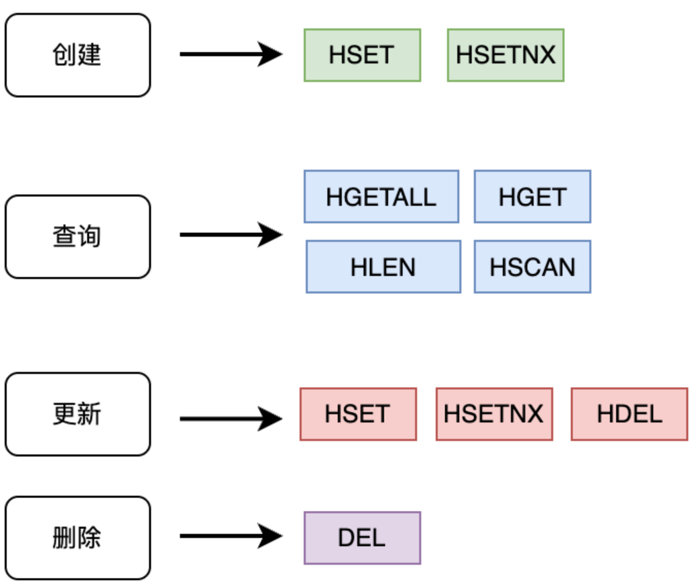
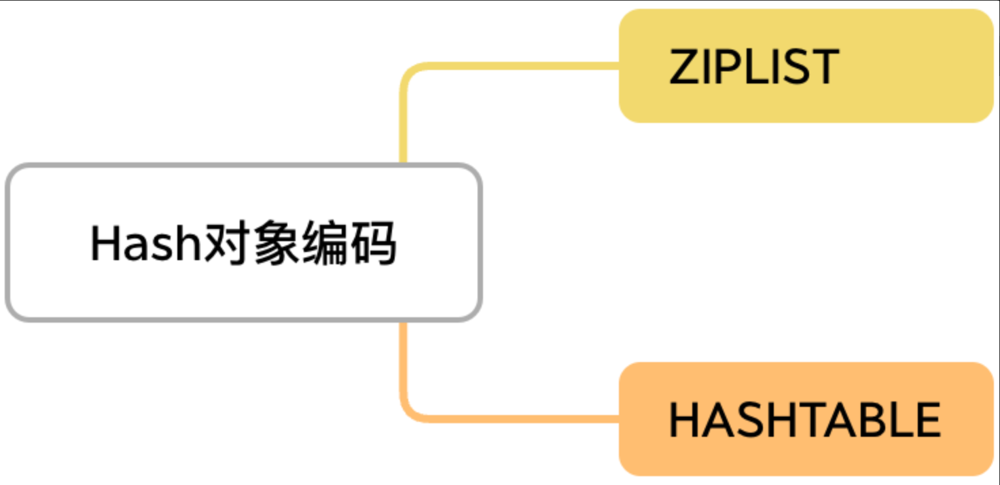
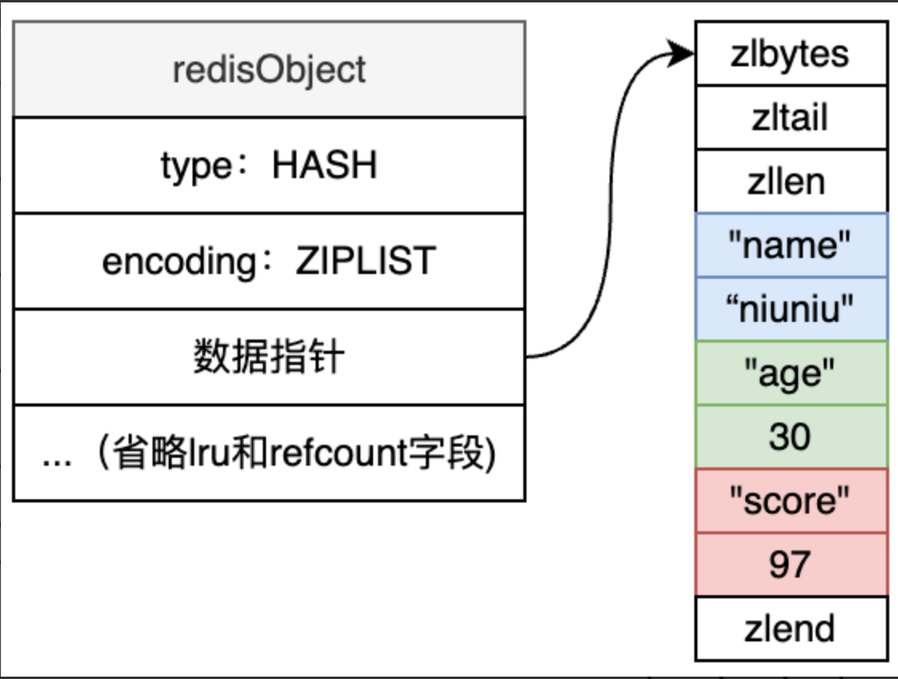
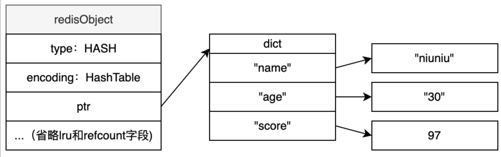

+++
title = "Hash"
weight = 10
type = "docs"
layout = "page"
+++

## 基本命令、常用操作



## 对象编码的方式



Ziplist

条件：1. Hash  对象的所有键值对长度小于 64 字节 ， 2. 键值对个数少于 512 个



Hashtable



```c
// 链表节点
typedef struct dictEntry {
    void *key;
    union {
        void *val;
        uint64_t u64;
        int64_t s64;
        double d;
    } v;
    struct dictEntry *next;
} dictEntry;

// 哈希表
typedef struct dictht {
    dictEntry **table;
    unsigned long size;
    unsigned long sizemask;
    unsigned long used;
} dictht;

// 新旧哈希表
typedef struct dict {
    dictType *type;
    void *privdata;
    dictht ht[2];
    long rehashidx; /* rehashing not in progress if rehashidx == -1 */
    unsigned long iterators; /* number of iterators currently running */
} dict;
```

## 适用场景

用户信息存储:将用户各个属性存为 hash 的不同 field

购物车:商品 ID 作为 field,数量作为 value

缓存对象:存储结构化数据,便于部分更新
