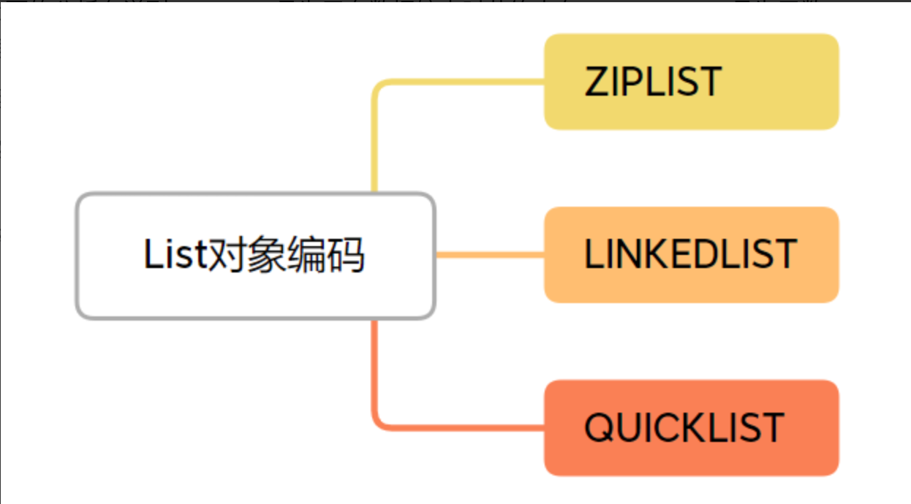
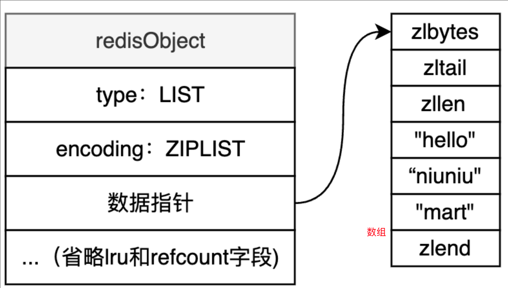
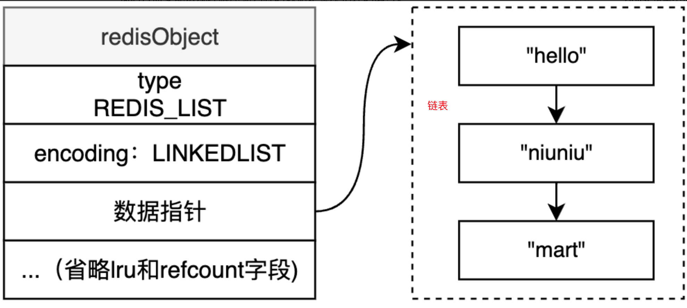

+++
title = "List"
weight = 20
type = "docs"
layout = "page"
+++

## 基本命令、常用操作

Lpush Rpush

Lpop Rpop lrem

Lrange llen

Del unlink

## 对象编码方式

Ziplist

条件：1. List 的每个元素大小不超过 64 字节，2. List 的元素个数不超过 512 个， 注意这里的 512 是 list 选择 ziplist 的条件， 对于 ziplist 本身的数据结构是可以超过 512 的

Linkedlist

Quicklist

## 适用场景

消息队列的 broker

任务队列
