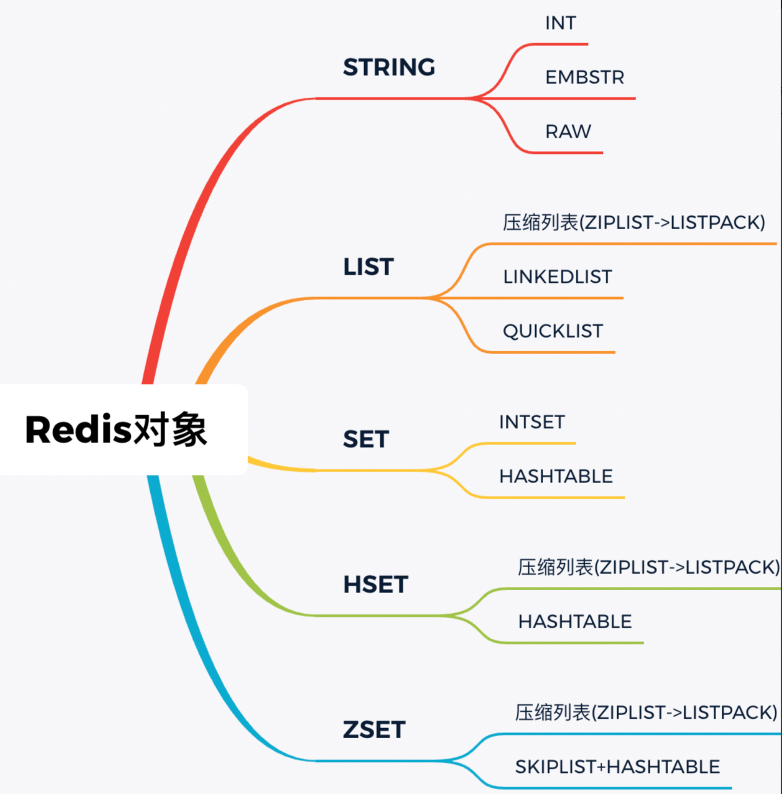

+++
title = "Object 理解"
weight = 30
type = "docs"
layout = "page"
+++

Redis 的多种数据结构底层均为统一的 redis object 对象

RedisObject 负责描述对象的元数据（如类型、编码方式、引用计数等）

对于 string 类型，SDS 负责存储具体的字符串数据

Object 命令 可查看某个键的元信息

Object help

redisObject 定义

```c
// redisObject 定义
typedef struct redisObject {
    unsigned type:4;
    unsigned encoding:4;
    unsigned lru:LRU_BITS; /* LRU time (relative to server.lruclock) or 
                              LFU data (least significant 8 bits frequency 
                              and most significant 16 bits access time). */
    int refcount;
    void *ptr;
} robj;
```

Redis 对象常用几种类型


