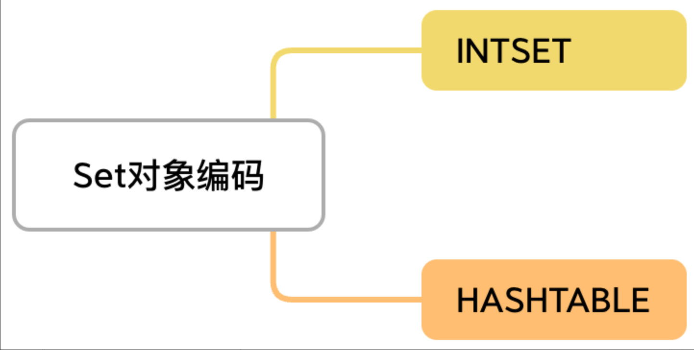
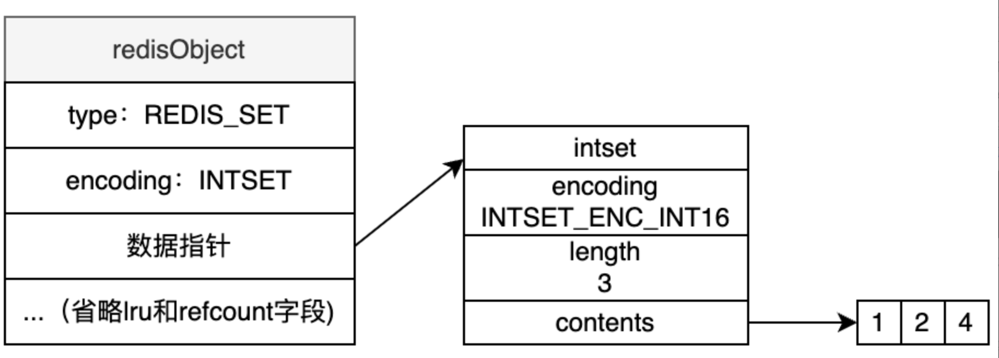
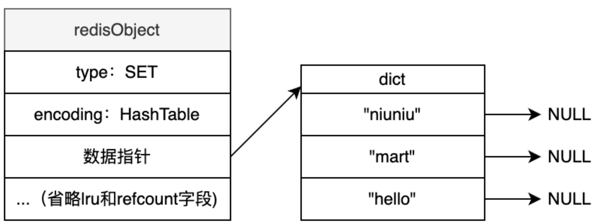

+++
title = "Set"
weight = 40
type = "docs"
layout = "page"
+++

## 基本命令、常用操作

Sadd

Smembers 查看所有成员

Scard 元素个数

Sscan 游标迭代查询 sscan key cursor match 1* count 10

Sinter

Sunion

Sdiff

Srem

Del

## 对象编码的方式



Intset

条件：1. 元素为整型 , 2. 元素个数不超过 512 个



Hashtable



HashTable 是由两个主要部分组成（PS：其实就是哈希表的链式地址方式，Go、Java 均采用此方式）

1. ```
      **哈希桶数组（buckets）**：

   •        一个包含指向键值对链表（entries）的**指针数组**。

   •        每个哈希桶对应一个哈希值区间，当多个键具有相同的哈希值时，会形成哈希碰撞，这些键会被存储在同一个链表中。
   ```
2. ```
      **链表（entries）**：

   •        每个链表节点存储一个键值对（key-value pair）。
   ```

```c
typedef struct dictEntry {
    void *key;
    union {
        void *val;
        uint64_t u64;
        int64_t s64;
        double d;
    } v;
    struct dictEntry *next;  // 指向下一个链表节点
} dictEntry;

typedef struct dictht {  // 哈希表
    dictEntry **table;  // 哈希桶数组
    unsigned long size;  // 哈希桶数组大小
    unsigned long sizemask;  // 哈希桶数组大小掩码，用于计算哈希值
    unsigned long used;  // 已使用的节点数
} dictht;

typedef struct dict {
    dictht ht[2];  // 两个哈希表用于渐进式 rehash
    long rehashidx;  // rehash 索引
    unsigned long iterators;  // 当前活跃的迭代器数
} dict;
```

dictEntry **table 实际上是一个指向 dictEntry * 数组的指针，哈希桶数组由 table 指针指向，具体如下：

```
    •        table 指向的数组是 dictEntry * 类型的数组，每个元素（桶）是一个指向 dictEntry 结构体的指针。

    •        这个数组中的每个 dictEntry * 指针代表一个哈希桶，桶内可以存储一个或多个 dictEntry 结构体。
```

当我们插入一个新的键值对时：

```
    1.        计算键的哈希值：hash = hashFunction(key)

    2.        计算索引：index = hash & (size - 1)

    3.        找到对应的桶：bucket = table[index]

    4.        将新的 dictEntry 插入到该桶对应的链表中
```

## 扩容缩容

扩容和缩容策略是基于哈希表的负载因子（load factor）来决定的。负载因子定义为哈希表中元素的数量 used 与哈希表大小 size（桶的数量）之比。Redis 通过维护一个合理的负载因子来确保哈希表的效率。

扩容策略：负载因子超过 1；缩容策略：负载因子低于 0.1

扩容时应该将哈希表的大小扩展到当前使用大小 used 的两倍且是最近的 2 的整数次幂；缩容时应该将哈希表的大小缩小到大于当前使用大小 used 的最小的 2 的整数次幂。具体来说：

```
    •        扩容时，如果 used 是 5，那么扩容后的大小应该是大于 10 且是 2 的整数次幂，即 16。

    •        缩容时，如果 used 是 5，那么缩容后的大小应该是大于 5 且是 2 的整数次幂，即 8。
```

## 适用场景

好友关系:利用集合的交集、并集等操作

标签系统:给内容打标签并进行标签交集查询=

独特访客统计:利用 Set 的唯一性特征

防止重放攻击时存储 nonce 随机数
