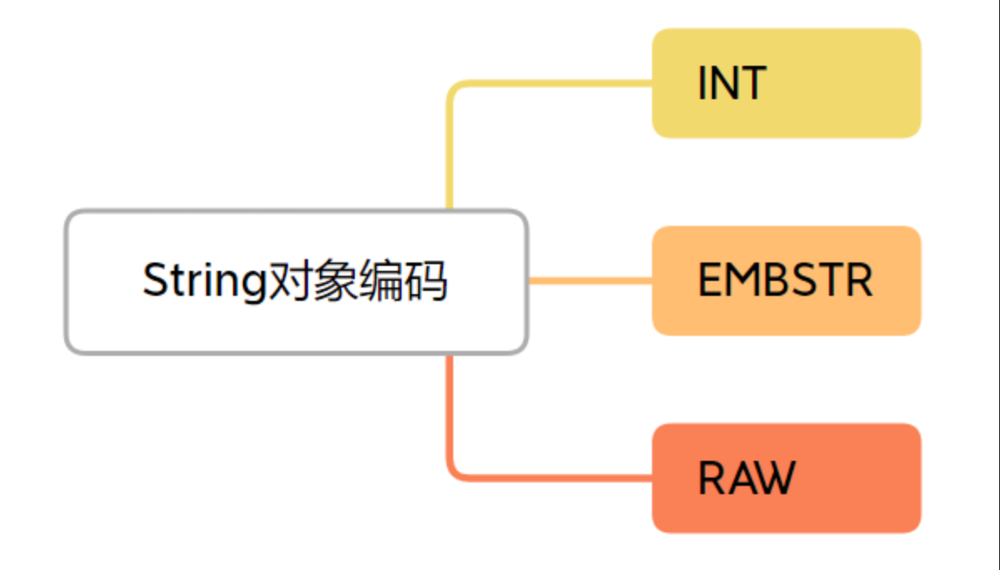
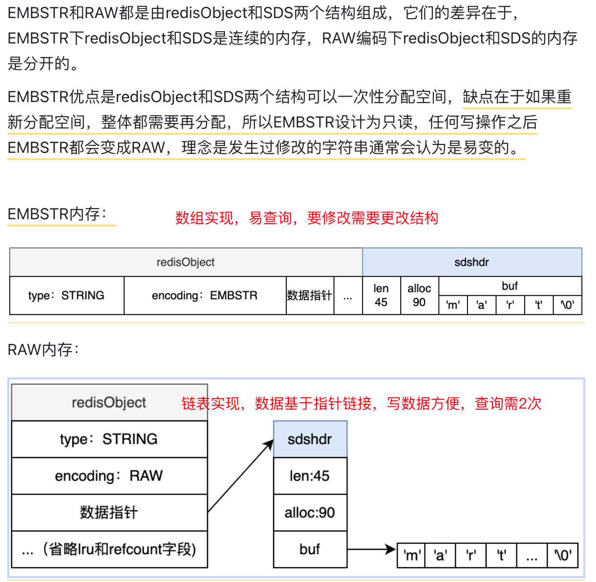

+++
title = "String"
weight = 50
type = "docs"
layout = "page"
+++

## 基本命令、常用操作

Get

Set

Setex

Setnx

Mget

Ulink  异步删除

最大 512 M

## 对象编码的方式

Int 只针对整型

Embstr 存储短字符串，44 字节及以内

Raw  存储长字符串

思考：为什么是 44 字节？

### 两种类型的内存结构

## 适用场景

缓存

计数

分布式锁

存储用户会话 session
