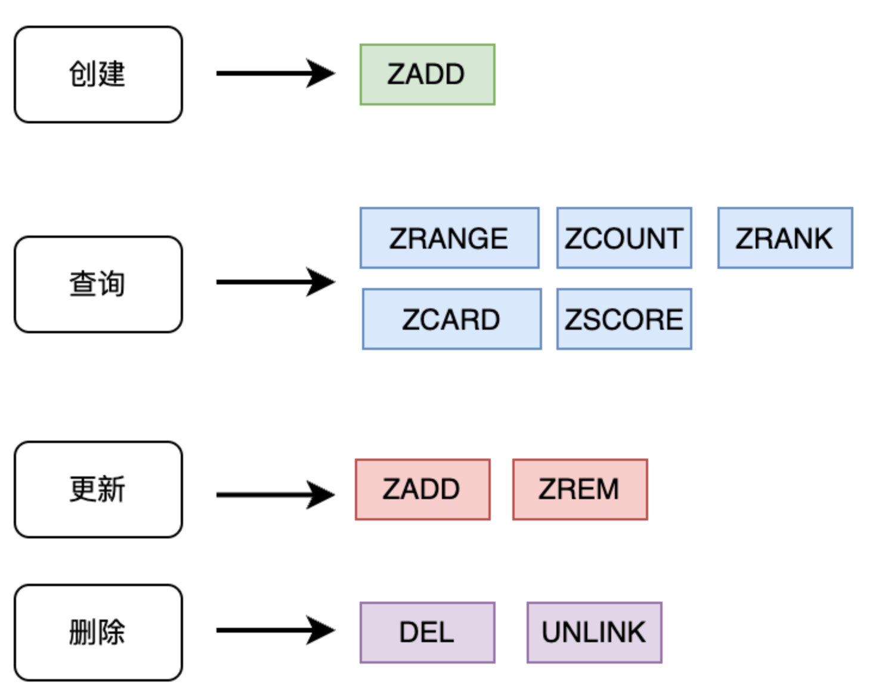
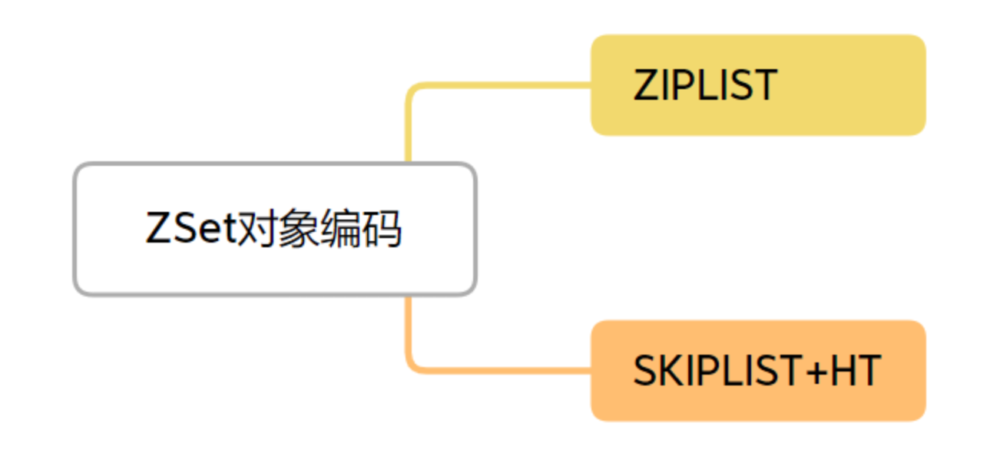
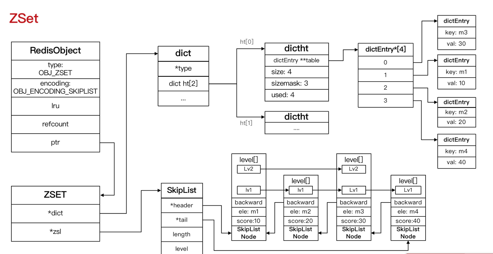
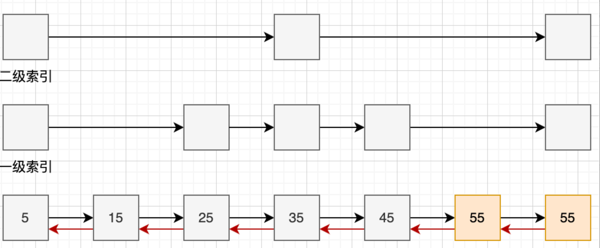

+++
title = "ZSet"
weight = 60
type = "docs"
layout = "page"
+++

## 基本命令、常用操作



## 对象编码的方式



Ziplist

条件：1. 所有字符串对象长度小于 64 字节 ， 2. 元素个数少于 128 个

Skiplist + hashtable （细品此图）



其中，Skiplist 如下：



标准的跳表的 score 值不重复， 却只有前进指针没有后退指针

Redis 跳表对标准的跳表进行了优化，score 值可以重复，且有后退指针。

redis 跳表 实际上是在普通的单链表基础上增加了回退指针， 且每一个节点上扩充了对后续节点的一个或多个索引。

时间复杂度从 O(n) 降到了 log(n)

用**概率均衡**的思路来确定新插入节点的层数

数据结构源码定义（对照上述图）

```c
// 节点
typedef struct zskiplistNode {
    sds ele;                   // 成员名
    double score;              // 分数
    struct zskiplistNode *backward; // 后退指针
    struct zskiplistLevel {
        struct zskiplistNode *forward; // 前进指针
        unsigned int span;    // 跨度
    } level[];
} zskiplistNode;

// 跳表
typedef struct zskiplist {
    struct zskiplistNode *header, *tail;
    unsigned long length;
    int level;
} zskiplist;

// ZSet 定义
typedef struct zset {
    dict *dict;  // 哈希表
    zskiplist *zsl; // 跳表
} zset;
```

## 适用场景

排行榜: 如游戏积分排行、新闻头条排行榜

优先级队列: 根据优先级管理任务

延迟任务: 以时间戳为分数,实现定时任务
