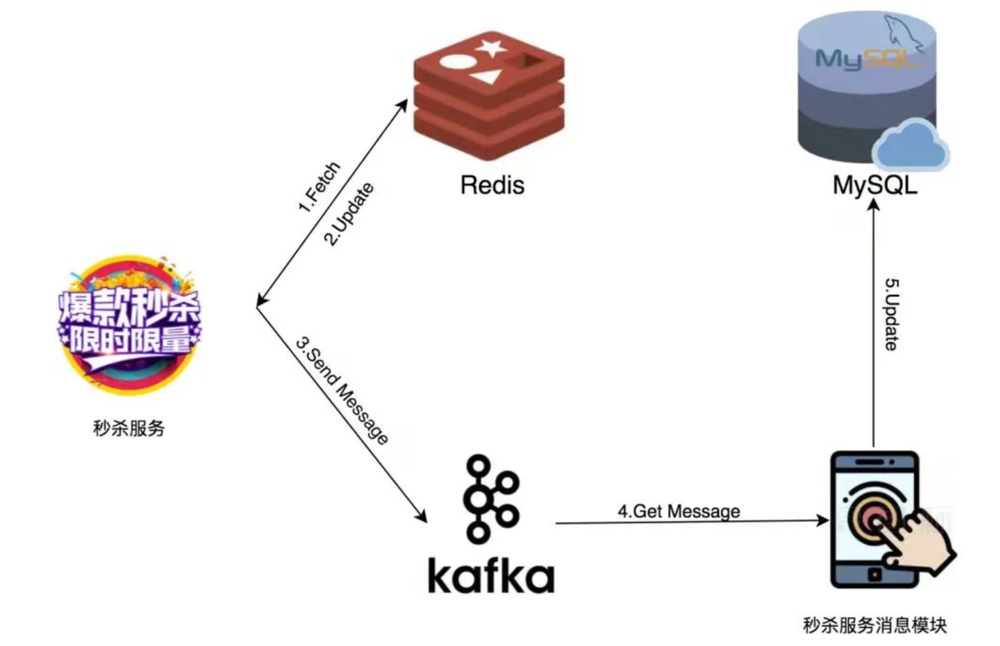
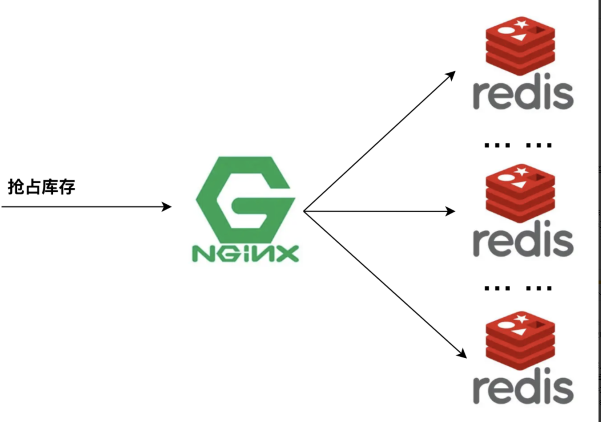

+++
title = "秒杀"
weight = 40
type = "docs"
layout = "page"
+++

某活动瞬时产生巨大的并发访问量

## 需要解决的问题

1. 大量的并发请求，服务器要能扛得住
2. 不能超卖
3. 避免少卖
4. 保证触达用户而非黄牛

## 如何高并发

将库存存储在 redis 中，通过 redis 扣减库存，这样高并发的请求打在 redis 上，并通过消息队列异步写库

单个 redis 通常 10W QPS 还是没问题的

若 QPS 达到了百万级及以上， 可以部署多个 redis 实例， 通过 nginx 负载均衡。 如库存有 1000， Redis 实例有 10 个，可以在每个 redis 上设置 100 的库存

## 不能超卖

抢购的过程主要有两步：

1. 第一步是查询库存是否够， 只有够了才进行第二步
2. 第二步是扣减库存

若进行第二步的过程中，库存不够了，这就导致了超卖，因此这两步需要是原子操作，

于是需要使用 lua 脚本执行这两步， 保证原子性

## 避免少卖

库存少了，但订单却没有生成

主要有两种可能：

1. 调用 redis 扣减库存的操作超时， 但实际上 redis 扣减库存操作是成功的
2. 扣件库存成功，但是异步发送写库消息失败

如何解决？

其实就是保证 redis 扣减库存与消息队列消费的一致性

方法：

1. 向消息队列发送写库操作失败时，进行渐进式重试
2. 将发送的消息写在磁盘上，慢慢重试，相对安全
3. 走 mysql 的 undo log、redo log 的 WAL 技术，更好但复杂

通常少卖的情况比较极端， 实在不行人工处理
