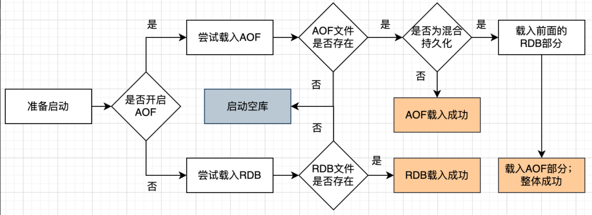

+++
title = "持久化"
weight = 30
type = "docs"
layout = "page"
+++

## RDB

默认开启

### 什么时候触发？

1. 命令触发， save 、 bgsave、flushall
2. 通常在服务退出时会触发，调用 save
3. 周期函数检测达到策略阈值会触发，调用 bgsave
4. 主从全量复制发送 RDB 文件

### 策略默认阈值

```c
save 900 1  # 900秒（15分钟）内至少有1个键被修改时，触发一次持久化
save 300 10 # 300秒（5分钟）内至少有10个键被修改时，触发一次持久化
save 60 10000 # 60秒（1分钟）内至少有10000个键被修改时，触发一次持久化
```

### 持久化过程

当周期函数检测达到策略阈值时，会 fork 一个子进程。 这个子进程通过**复制页表**的方式与主进程共享内存，并开始将数据写入到临时的 RDB 文件

在这个过程中主进程可能会有读写操作，当有写操作时，主进程会将共享内存复制一份（即**写时复制**），用于自身进行数据修改， 保证与子进程的持久化过程使用的内存隔离，这样不会影响子进程进行 RDB 持久化

当子进程的 RDB 持久化过程完成以后，子线程会被销毁且使用的内存空间也会被销毁。

注意，**RDB 持久化的过程中，主进程所做的修改是不会被子进程写入到 RDB 文件中的**

## AOF

AOF 是通过记录所有写操作命令来实现数据持久化的。AOF 文件包含了 Redis 服务启动以来执行的所有写操作命令，按顺序记录。当 Redis 重启时，它会通过重新执行 AOF 文件中的命令来恢复数据。

### **主要特点**

```
    1.        **更高的数据安全性**：
```

AOF 能够提供更高的数据安全性。你可以通过配置 AOF 持久化策略来确定写操作命令何时同步到磁盘。

```
    2.        **可读性**：
```

AOF 文件是以 Redis 命令的格式保存的，具有良好的可读性，这使得调试和分析问题更加方便。

```
    3.        **日志重写**：
```

随着时间的推移，AOF 文件会变得越来越大。Redis 提供了日志重写机制，通过创建新的 AOF 文件来压缩旧的日志文件，从而减少文件大小。

通过配置文件开启 AOF

```c
appendonly yes
```

### 三种刷盘策略

Redis 提供了三种刷盘策略（即将 AOF 缓冲写入磁盘），可以通过配置 appendfsync 参数来设置：

```
    •        appendfsync always：每次写操作都会立即同步到磁盘，最安全但性能最差。

    •        appendfsync everysec：每秒钟同步一次，平衡了性能和安全性。

    •        appendfsync no：不主动同步，由操作系统决定何时进行同步，性能最好但最不安全。
```

官方推荐第二种，默认也是第二种

PS：从这里结合 MySQL 的 redo 日志刷盘策略， MySQL 默认选择的是方式一。因此，MySQL 选择了一致性，Redis 平衡了性能，抛弃了部分一致性

### 持久化过程

每次有写入操作时，会将写入命令记录到 AOF 缓冲区，根据策略进行如下操作：

若 appendfsync=always，则立即写入磁盘，这个过程是同步阻塞的

若 appendfsync=everysec，则由主进程异步执行的，主进程定期（每秒）将 AOF 缓存写入到磁盘

若 appendfsync=no，不做刷盘处理，交给操作系统的文件系统缓冲机制自行刷盘

### 重写条件

当 AOF 文件随着时间会不断累积增大，达到一定的条件会重写

条件配置如下：

```c
// 超过了一倍
auto-aof-rewrite-percentage 100
// 超过 64 M
auto-aof-rewrite-min-size 64mb
```

### **AOF 文件重写过程**

当 AOF 文件触发重写条件时，Redis 会进行 AOF 重写。重写过程如下：

1. 创建一个子进程来执行重写操作
2. 子进程遍历 Redis 的内存数据结构，将每个键值对的状态转换为 Redis 命令格式，并写入到新的 AOF 文件中。
3. 在子进程重写过程中，主进程新的写操作会记录到 AOF 缓冲区中，同时也会被记录到一个**临时 AOF 缓冲区**中，以便在子进程重写完成后追加到新的 AOF 文件中。
4. 第 2 步子进程生成 AOF 后通知主进程，主进程会在某个**安全点**将临时缓冲区中的操作追加到新的 AOF 文件中
5. 替换旧的 AOF 文件。

这个过程中，原 AOF 缓冲用于防止过程中断电也能通过原 AOF 文件恢复；临时 AOF 缓冲最终会被追加到新 AOF 文件，使生成新 AOF 文件过程中的新写入操作不会丢失

## AOF 混合持久化

5.0 版本后，只要开启了 AOF 就是默认开启了混合持久化

根据上述 AOF 文件重写的过程，子进程在生成新的 AOF 文件，这一步骤变成了生成 RDB 文件，这个过程中新的写入操作会生成增量 AOF 文件

所以混合持久化可以理解为 是 AOF 模式的优化。


