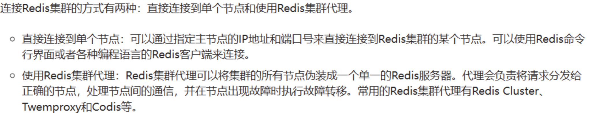
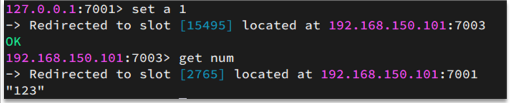

+++
title = "集群"
weight = 50
type = "docs"
layout = "page"
+++

Redis 单机可做到 写几万、读几十万 的 TPS

## 部署、搭建、操作集群

## 如何访问 redis 集群？

redis 6 后，查询或写入会自动计算槽并切节点查询或写入

## Redis 哈希槽 Slot

Redis 集群通过分片（sharding）来实现数据的水平扩展

将所有的键空间分为 16384 个槽

### 一致性哈希
